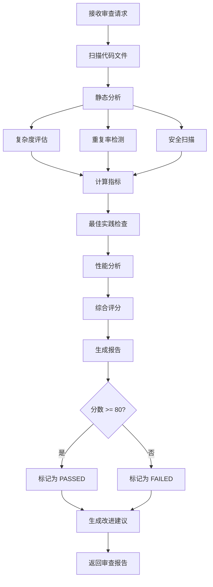

# Code Review Agent 详细指南

**版本**: 1.0  
**最后更新**: 2026-04-16  
**维护者**: Documentation Agent  

---

## 🎯 角色定位

**Code Review Agent** 是自动化代码质量审查的智能体,负责分析代码复杂度、检测安全漏洞、评估最佳实践遵循情况,并提供可操作的改进建议。

**调用脚本**: `.lingma/scripts/code-reviewer.py`

---

## 📋 核心职责

### 1. 静态代码分析
- 代码复杂度评估 (圈复杂度、认知复杂度)
- 代码重复率检测
- 代码风格检查
- 命名规范验证

### 2. 安全漏洞扫描
- 依赖漏洞检测 (npm audit, pip-audit, cargo-audit)
- 常见安全问题识别 (SQL注入、XSS、硬编码密钥等)
- 权限和访问控制审查
- 数据泄露风险评估

### 3. 最佳实践检查
- SOLID 原则遵循
- DRY (Don't Repeat Yourself)
- KISS (Keep It Simple, Stupid)
- YAGNI (You Aren't Gonna Need It)
- 错误处理完整性
- 日志记录充分性

### 4. 性能分析
- 时间复杂度评估
- 空间复杂度评估
- 潜在性能瓶颈识别
- 资源泄漏检测

### 5. 质量评分
- 综合计算代码质量分数 (0-100)
- 提供详细的评分分解
- 生成优先级排序的改进建议

---

## 🔧 API 参考

### 主要方法

#### `review_code(code_path: str, config: ReviewConfig) -> ReviewReport`
执行代码审查

**参数**:
```python
ReviewConfig(
    languages: List[str],  # ["python", "typescript", "rust"]
    severity_threshold: str = "medium",  # "low" | "medium" | "high" | "critical"
    enable_security_scan: bool = True,
    enable_performance_check: bool = True,
    max_complexity: int = 10
)
```

**返回**:
```python
ReviewReport(
    overall_score: float,  # 0-100
    passed: bool,
    issues: List[CodeIssue],
    metrics: CodeMetrics,
    recommendations: List[Recommendation]
)
```

#### `calculate_quality_score(metrics: CodeMetrics) -> float`
计算质量分数

**评分维度**:
- 复杂度 (25%)
- 重复率 (20%)
- 安全性 (30%)
- 最佳实践 (15%)
- 可读性 (10%)

#### `generate_fix_suggestions(issues: List[CodeIssue]) -> List[FixSuggestion]`
生成修复建议

**返回**:
```python
FixSuggestion(
    issue_id: str,
    description: str,
    priority: str,  # "high" | "medium" | "low"
    estimated_effort: str,  # "1h" | "2-4h" | "1-2 days"
    code_example: Optional[str],
    references: List[str]
)
```

---

## 💡 使用示例

### 示例1: 审查 Python 代码

```bash
python .lingma/scripts/code-reviewer.py --json-rpc <<EOF
{
  "method": "review_code",
  "params": {
    "code_path": ".lingma/scripts/",
    "languages": ["python"],
    "severity_threshold": "medium",
    "enable_security_scan": true
  },
  "id": "review-001"
}
EOF
```

### 示例2: 多语言项目审查

```python
from code_reviewer import CodeReviewAgent

agent = CodeReviewAgent()

config = ReviewConfig(
    languages=["python", "typescript", "rust"],
    severity_threshold="high",
    enable_security_scan=True,
    enable_performance_check=True
)

report = agent.review_code("src/", config)

print(f"Overall Score: {report.overall_score}/100")
print(f"Total Issues: {len(report.issues)}")
print(f"Critical: {sum(1 for i in report.issues if i.severity == 'critical')}")
```

### 示例3: 获取修复建议

```python
suggestions = agent.generate_fix_suggestions(report.issues)

for suggestion in suggestions[:5]:  # Top 5 priorities
    print(f"\n[{suggestion.priority.upper()}] {suggestion.description}")
    print(f"Estimated effort: {suggestion.estimated_effort}")
    if suggestion.code_example:
        print(f"Example:\n{suggestion.code_example}")
```

### 示例4: 对比历史审查结果

```python
current_report = agent.review_code("src/", config)
previous_report = agent.load_previous_report("review-20260415.json")

diff = agent.compare_reports(current_report, previous_report)

print(f"Score change: {diff.score_change:+.1f}")
print(f"New issues: {len(diff.new_issues)}")
print(f"Resolved issues: {len(diff.resolved_issues)}")
```

---

## 🏗️ 工作流程



---

## ⚙️ 配置选项

### 工具配置

#### Python - Pylint (.pylintrc)
```ini
[MASTER]
load-plugins=pylint.extensions.docparams

[MESSAGES CONTROL]
disable=C0114,C0115,C0116  # 禁用文档字符串警告

[DESIGN]
max-args=5
max-locals=15
max-returns=6
max-branches=12
max-statements=50
max-parents=7
max-attributes=7
min-public-methods=2
max-public-methods=20
max-bool-expr=5
```

#### TypeScript - ESLint (.eslintrc.json)
```json
{
  "extends": [
    "eslint:recommended",
    "plugin:@typescript-eslint/recommended"
  ],
  "rules": {
    "complexity": ["error", { "max": 10 }],
    "max-depth": ["error", 4],
    "max-lines-per-function": ["warn", 50],
    "@typescript-eslint/no-explicit-any": "warn"
  }
}
```

#### Rust - Clippy (rust-toolchain.toml)
```toml
[toolchain]
channel = "stable"
components = ["clippy", "rustfmt"]

[workspace.lints.clippy]
complexity = "warn"
perf = "warn"
style = "warn"
pedantic = "warn"
```

### 环境变量

| 变量 | 说明 | 默认值 |
|------|------|--------|
| `REVIEW_SEVERITY` | 最低严重级别 | `medium` |
| `MAX_COMPLEXITY` | 最大允许复杂度 | `10` |
| `MAX_DUPLICATION` | 最大允许重复率(%) | `5` |
| `SECURITY_SCAN_ENABLED` | 启用安全扫描 | `true` |

---

## 📊 审查报告格式

### JSON 报告示例

```json
{
  "review_id": "review-20260416-001",
  "timestamp": "2026-04-16T15:30:00Z",
  "code_path": ".lingma/scripts/",
  "overall_score": 87.5,
  "passed": true,
  "metrics": {
    "complexity": {
      "average_cyclomatic": 7.2,
      "max_cyclomatic": 12,
      "functions_over_threshold": 2,
      "score": 9.2
    },
    "duplication": {
      "percentage": 3.2,
      "duplicate_blocks": 5,
      "largest_block_lines": 15,
      "score": 8.5
    },
    "security": {
      "critical": 0,
      "high": 0,
      "medium": 1,
      "low": 3,
      "score": 9.0
    },
    "best_practices": {
      "violations": 2,
      "warnings": 5,
      "score": 8.0
    },
    "readability": {
      "naming_score": 8.5,
      "comment_score": 7.0,
      "structure_score": 8.5,
      "consistency_score": 9.0,
      "average": 8.25
    }
  },
  "issues": [
    {
      "id": "ISSUE-001",
      "severity": "medium",
      "category": "complexity",
      "file": "supervisor-agent.py",
      "line": 150,
      "function": "_execute_parallel",
      "message": "Function has cyclomatic complexity of 12 (threshold: 10)",
      "recommendation": "Consider splitting this function into smaller helper functions"
    },
    {
      "id": "ISSUE-002",
      "severity": "low",
      "category": "security",
      "file": "agent_client.py",
      "line": 234,
      "message": "User input not sanitized before subprocess call",
      "recommendation": "Use shlex.quote() to sanitize command arguments"
    }
  ],
  "recommendations": [
    {
      "priority": "high",
      "description": "Refactor _execute_parallel to reduce complexity",
      "estimated_effort": "2-4h",
      "impact": "Improves maintainability and testability"
    },
    {
      "priority": "medium",
      "description": "Add input sanitization for subprocess calls",
      "estimated_effort": "1h",
      "impact": "Prevents command injection vulnerabilities"
    }
  ]
}
```

---

## 🐛 故障排查

### 问题1: 误报过多

**症状**: 大量低优先级问题淹没真正重要的问题

**解决**:
```python
# 1. 调整严重性阈值
config = ReviewConfig(severity_threshold="high")

# 2. 添加忽略规则
# .reviewignore
tests/*
generated/*
*.config.js

# 3. 自定义规则
config.custom_rules = {
    "ignore_docstring_for_private_methods": True,
    "allow_magic_numbers_in_tests": True
}
```

### 问题2: 扫描速度慢

**症状**: 大型项目审查耗时超过10分钟

**解决**:
```bash
# 1. 增量扫描 (只扫描变更文件)
git diff --name-only HEAD~1 | xargs python code-reviewer.py --files

# 2. 并行扫描
python code-reviewer.py --parallel --workers 4

# 3. 缓存结果
python code-reviewer.py --cache --cache-ttl 3600
```

### 问题3: 安全评分不准确

**症状**: 已知漏洞未被检测到

**解决**:
```bash
# 1. 更新漏洞数据库
pip-audit --fix
npm audit fix
cargo audit fetch

# 2. 使用多个扫描器
# Bandit + Safety for Python
# npm audit + Snyk for JavaScript
# cargo-audit + cargo-deny for Rust

# 3. 手动验证关键路径
# - 认证和授权逻辑
# - 数据加密和解密
# - 外部API调用
```

---

## 🎓 最佳实践

### 1. 自动化集成
```yaml
# .github/workflows/code-review.yml
name: Code Review

on: [pull_request]

jobs:
  review:
    runs-on: ubuntu-latest
    steps:
      - uses: actions/checkout@v3
      - name: Run Code Review
        run: python .lingma/scripts/code-reviewer.py --json-rpc < review-input.json
      - name: Upload Report
        uses: actions/upload-artifact@v3
        with:
          name: code-review-report
          path: review-report.json
```

### 2. 渐进式改进
- **第一周**: 仅报告 Critical 问题
- **第二周**: 报告 High + Critical
- **第三周**: 报告 Medium + High + Critical
- **第四周**: 全量报告并设置门禁

### 3. 技术债务管理
```python
# 标记技术债务
# TODO(tech-debt): Refactor this function - Complexity: 15
# FIXME(security): Add input validation - Priority: High
# HACK(performance): Temporary workaround - Ticket: PERF-123
```

### 4. 审查清单
- [ ] 代码是否符合编码规范?
- [ ] 是否有安全漏洞?
- [ ] 复杂度是否在可接受范围内?
- [ ] 是否有充分的错误处理?
- [ ] 日志记录是否完整?
- [ ] 性能是否可接受?
- [ ] 是否有足够的测试覆盖?
- [ ] 文档是否同步更新?

---

## 📈 性能指标

| 指标 | 目标 | 当前 |
|------|------|------|
| 平均审查时间 | < 5min | - |
| 误报率 | < 5% | - |
| 漏报率 | < 1% | - |
| 建议采纳率 | > 70% | - |
| 代码质量提升 | +10%/月 | - |

---

## 🔗 相关文档

- [Quality Gates Standard](quality-gates.md)
- [Security Best Practices](../guides/security-best-practices.md)
- [Code Style Guide](../guides/code-style-guide.md)

---

**维护说明**: 本文档应随审查规则和工具演进而更新。每次添加新的检查项或改变评分算法时必须同步更新。
