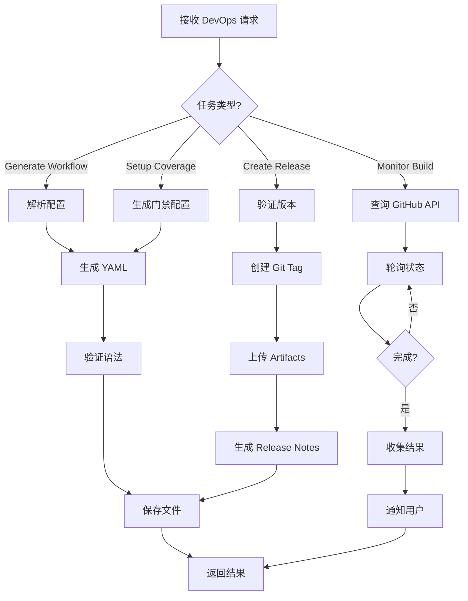

# DevOps Agent 详细指南

**版本**: 1.0  
**最后更新**: 2026-04-16  
**维护者**: Documentation Agent  

---

## 🎯 角色定位

**DevOps Agent** 是自动化 CI/CD 配置和部署管理的智能体,负责生成和维护 GitHub Actions workflows、Docker 配置、基础设施即代码,确保持续集成和持续交付流程的高效运行。

**职责范围**: CI/CD 配置管理、自动化测试流水线、构建发版、远程监控

---

## 📋 核心职责

### 1. CI/CD 流水线配置
- 生成 GitHub Actions workflows
- 配置多语言测试矩阵 (Python/TypeScript/Rust)
- 设置测试覆盖率门禁
- 自动化依赖缓存和并行执行

### 2. 构建和发版自动化
- 语义化版本管理 (SemVer)
- 自动生成 CHANGELOG
- Git Tag 创建和推送
- Release Notes 生成
- 构建产物归档

### 3. 失败通知和问题追踪
- CI 失败时自动创建 GitHub Issue
- 发送通知到 Slack/邮件
- 附带失败日志和截图
- 分配给相关负责人

### 4. 性能优化
- 依赖缓存策略 (pnpm/cargo/pip)
- Job Matrix 并行执行
- 超时控制和自动重试
- 构建时间分析和优化建议

### 5. 安全加固
- Secrets 管理
- 依赖漏洞扫描
- 容器镜像安全扫描
- 权限最小化原则

---

## 🔧 API 参考

### 主要方法

#### `generate_workflow(workflow_config: WorkflowConfig) -> str`
生成 GitHub Actions workflow YAML

**参数**:
```python
WorkflowConfig(
    name: str,
    triggers: List[str],  # ["push", "pull_request"]
    jobs: List[JobConfig],
    environment_vars: Dict[str, str]
)
```

**返回**: YAML 格式的 workflow 内容

#### `setup_coverage_gate(config: CoverageConfig) -> str`
配置测试覆盖率门禁

**参数**:
```python
CoverageConfig(
    language: str,  # "python" | "typescript" | "rust"
    threshold: float,  # 80.0
    fail_on_decrease: bool = True,
    report_format: str = "xml"  # "xml" | "html" | "json"
)
```

#### `create_release(version: str, changelog: str, artifacts: List[str]) -> ReleaseResult`
创建 GitHub Release

**返回**:
```python
ReleaseResult(
    tag_name: str,
    release_url: str,
    assets_uploaded: List[str],
    status: str  # "success" | "failed"
)
```

#### `monitor_build(run_id: str) -> BuildStatus`
监控远程构建状态

**返回**:
```python
BuildStatus(
    status: str,  # "queued" | "in_progress" | "completed" | "failed"
    conclusion: Optional[str],
    duration_seconds: Optional[int],
    logs_url: str,
    artifacts: List[str]
)
```

---

## 💡 使用示例

### 示例1: 生成 CI 测试 Workflow

```bash
python .lingma/scripts/devops-agent.py --json-rpc <<EOF
{
  "method": "generate_workflow",
  "params": {
    "workflow_name": "CI Tests",
    "triggers": ["push", "pull_request"],
    "jobs": [
      {
        "name": "test-python",
        "runs_on": "ubuntu-latest",
        "steps": [
          {"uses": "actions/checkout@v3"},
          {"uses": "actions/setup-python@v4", "with": {"python-version": "3.11"}},
          {"run": "pip install pytest pytest-cov"},
          {"run": "pytest --cov=.lingma/scripts --cov-report=xml"}
        ]
      }
    ]
  },
  "id": "devops-001"
}
EOF
```

### 示例2: 配置覆盖率门禁

```python
from devops_agent import DevOpsAgent

agent = DevOpsAgent()

coverage_config = CoverageConfig(
    language="python",
    threshold=80.0,
    fail_on_decrease=True,
    report_format="xml"
)

workflow_snippet = agent.setup_coverage_gate(coverage_config)
print(workflow_snippet)
```

### 示例3: 自动化发版

```bash
# 创建 v1.2.0 release
python .lingma/scripts/devops-agent.py --release \
  --version 1.2.0 \
  --changelog CHANGELOG.md \
  --artifacts dist/*.whl,dist/*.tar.gz
```

### 示例4: 监控远程构建

```python
# 监控 GitHub Actions build
build_status = agent.monitor_build(run_id="1234567890")

if build_status.status == "failed":
    print(f"Build failed! Logs: {build_status.logs_url}")
    # 自动创建 Issue
    agent.create_issue_from_failure(build_status)
elif build_status.status == "completed":
    print(f"Build succeeded in {build_status.duration_seconds}s")
    print(f"Artifacts: {', '.join(build_status.artifacts)}")
```

### 示例5: 优化构建性能

```python
# 分析构建时间
analysis = agent.analyze_build_performance(
    workflow=".github/workflows/ci.yml",
    period_days=30
)

print("Slowest jobs:")
for job in analysis.slowest_jobs[:5]:
    print(f"  {job.name}: {job.avg_duration}s")

print("\nOptimization suggestions:")
for suggestion in analysis.suggestions:
    print(f"  - {suggestion}")
```

---

## 🏗️ 工作流程



---

## ⚙️ 配置选项

### GitHub Actions Workflow 模板

```yaml
# .github/workflows/ci-tests.yml
name: CI Tests

on:
  push:
    branches: [main, develop]
  pull_request:
    branches: [main]

env:
  PYTHON_VERSION: '3.11'
  NODE_VERSION: '18'
  RUST_VERSION: 'stable'

jobs:
  test-python:
    runs-on: ubuntu-latest
    timeout-minutes: 10
    
    steps:
      - uses: actions/checkout@v3
      
      - name: Set up Python
        uses: actions/setup-python@v4
        with:
          python-version: ${{ env.PYTHON_VERSION }}
          cache: 'pip'
      
      - name: Install dependencies
        run: |
          python -m pip install --upgrade pip
          pip install pytest pytest-cov bandit
      
      - name: Run tests with coverage
        run: |
          pytest .lingma/scripts/ \
            --cov=.lingma/scripts \
            --cov-report=xml:coverage.xml \
            --cov-report=html:htmlcov \
            --junitxml=junit-results.xml \
            -v
      
      - name: Upload coverage to Codecov
        uses: codecov/codecov-action@v3
        with:
          files: ./coverage.xml
          fail_ci_if_error: true
          minimum_coverage: 80
      
      - name: Security scan
        run: bandit -r .lingma/scripts/ -f json -o bandit-report.json
      
      - name: Upload test results
        if: always()
        uses: actions/upload-artifact@v3
        with:
          name: python-test-results
          path: |
            junit-results.xml
            htmlcov/
            bandit-report.json

  test-typescript:
    runs-on: ubuntu-latest
    timeout-minutes: 15
    
    steps:
      - uses: actions/checkout@v3
      
      - name: Setup Node.js
        uses: actions/setup-node@v3
        with:
          node-version: ${{ env.NODE_VERSION }}
          cache: 'pnpm'
      
      - name: Install dependencies
        run: pnpm install
      
      - name: Run tests
        run: pnpm test -- --coverage
      
      - name: Run E2E tests
        run: npx playwright test
      
      - name: Upload test results
        if: always()
        uses: actions/upload-artifact@v3
        with:
          name: typescript-test-results
          path: |
            coverage/
            playwright-report/

  test-rust:
    runs-on: ubuntu-latest
    timeout-minutes: 20
    
    steps:
      - uses: actions/checkout@v3
      
      - name: Install Rust
        uses: dtolnay/rust-toolchain@stable
        with:
          components: clippy, rustfmt
      
      - name: Cache cargo registry
        uses: actions/cache@v3
        with:
          path: |
            ~/.cargo/bin/
            ~/.cargo/registry/index/
            ~/.cargo/registry/cache/
            ~/.cargo/git/db/
            sys-monitor/src-tauri/target/
          key: ${{ runner.os }}-cargo-${{ hashFiles('**/Cargo.lock') }}
      
      - name: Run tests
        run: cargo test --all-targets --verbose
      
      - name: Run clippy
        run: cargo clippy -- -D warnings
      
      - name: Check formatting
        run: cargo fmt --all --check

  notify-on-failure:
    needs: [test-python, test-typescript, test-rust]
    if: failure()
    runs-on: ubuntu-latest
    
    steps:
      - name: Create GitHub Issue
        uses: actions/github-script@v6
        with:
          script: |
            const failedJobs = context.payload.workflow_run?.jobs?.filter(j => j.conclusion === 'failure') || [];
            github.rest.issues.create({
              owner: context.repo.owner,
              repo: context.repo.repo,
              title: `CI Failed: ${context.workflow} - ${new Date().toISOString()}`,
              body: `## Failed Jobs\n\n${failedJobs.map(j => `- ${j.name}`).join('\n')}\n\nCheck logs: ${context.serverUrl}/${context.repo.owner}/${context.repo.repo}/actions/runs/${context.runId}`,
              labels: ['ci-failed', 'needs-investigation']
            });
```

### 环境变量

| 变量 | 说明 | 默认值 |
|------|------|--------|
| `GITHUB_TOKEN` | GitHub API Token | `${{ secrets.GITHUB_TOKEN }}` |
| `CODECOV_TOKEN` | Codecov 上传 Token | `${{ secrets.CODECOV_TOKEN }}` |
| `SLACK_WEBHOOK` | Slack 通知 Webhook | - |
| `BUILD_TIMEOUT` | 构建超时(分钟) | `30` |

---

## 📊 监控指标

### 构建性能指标

| 指标 | 目标 | 当前 |
|------|------|------|
| 平均构建时间 | < 10min | - |
| 构建成功率 | > 95% | - |
| 缓存命中率 | > 80% | - |
| 失败恢复时间 | < 30min | - |

### 发布指标

| 指标 | 目标 | 当前 |
|------|------|------|
| 发布频率 | 每周 1-2 次 | - |
| 发布成功率 | 100% | - |
| Rollback 次数 | 0 | - |
| 平均发布时间 | < 5min | - |

---

## 🐛 故障排查

### 问题1: 构建速度慢

**症状**: CI 构建超过20分钟

**解决**:
```yaml
# 1. 启用缓存
- uses: actions/cache@v3
  with:
    path: ~/.cache/pip
    key: ${{ runner.os }}-pip-${{ hashFiles('**/requirements.txt') }}

# 2. 并行执行
strategy:
  matrix:
    python-version: ['3.9', '3.10', '3.11']
  max-parallel: 3

# 3. 减少不必要的步骤
# 移除冗余的 lint/format 检查
# 合并相关的测试步骤
```

### 问题2: Flaky CI Failures

**症状**: 同一 commit 有时通过有时失败

**解决**:
```yaml
# 1. 增加重试机制
- name: Run tests with retry
  uses: nick-fields/retry@v2
  with:
    max_attempts: 3
    timeout_minutes: 10
    command: pytest tests/

# 2. 固定随机种子
# 在测试代码中
import random
random.seed(42)

# 3. 隔离外部依赖
# Mock API calls, database connections
```

### 问题3: Secrets 泄露风险

**症状**: Workflow 中硬编码敏感信息

**解决**:
```yaml
# ❌ 危险: 硬编码 secret
- run: curl -H "Authorization: token abc123" ...

# ✅ 安全: 使用 GitHub Secrets
- run: curl -H "Authorization: token ${{ secrets.API_TOKEN }}" ...

# 在 Repository Settings > Secrets 中添加
# API_TOKEN = abc123
```

---

## 🎓 最佳实践

### 1. 工作流模块化
```yaml
# 复用 composite actions
# .github/actions/setup-python/action.yml
name: 'Setup Python Environment'
description: 'Install Python and dependencies'

inputs:
  python-version:
    required: true
  requirements-file:
    default: 'requirements.txt'

runs:
  using: 'composite'
  steps:
    - uses: actions/setup-python@v4
      with:
        python-version: ${{ inputs.python-version }}
    - run: pip install -r ${{ inputs.requirements-file }}
      shell: bash
```

### 2. 环境分离
```yaml
jobs:
  test:
    runs-on: ubuntu-latest
    environment: testing  # Testing environment
  
  deploy-staging:
    needs: test
    runs-on: ubuntu-latest
    environment: staging  # Staging environment
    if: github.ref == 'refs/heads/develop'
  
  deploy-production:
    needs: deploy-staging
    runs-on: ubuntu-latest
    environment: production  # Production environment (requires approval)
    if: github.ref == 'refs/heads/main'
```

### 3. 自动化版本管理
```bash
# bumpversion 工具
pip install bumpversion

# 自动递增版本号
bumpversion patch  # 1.2.3 -> 1.2.4
bumpversion minor  # 1.2.3 -> 1.3.0
bumpversion major  # 1.2.3 -> 2.0.0
```

### 4. 构建产物管理
```yaml
- name: Upload build artifacts
  uses: actions/upload-artifact@v3
  with:
    name: build-${{ github.sha }}
    path: dist/
    retention-days: 30

- name: Download artifacts
  uses: actions/download-artifact@v3
  with:
    name: build-${{ github.sha }}
    path: dist/
```

---

## 🔗 相关文档

- [GitHub Actions Documentation](https://docs.github.com/en/actions)
- [Semantic Versioning](https://semver.org/)
- [Keep a Changelog](https://keepachangelog.com/)

---

**维护说明**: 本文档应随 CI/CD 工具和流程演进而更新。每次添加新的部署目标或改变发布策略时必须同步更新。
