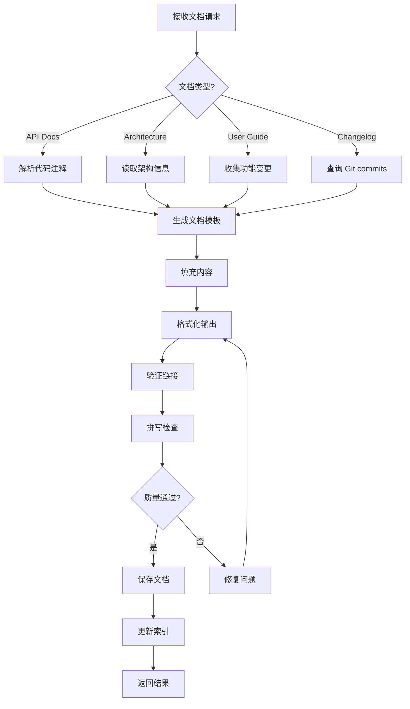

# Documentation Agent 详细指南

**版本**: 1.0  
**最后更新**: 2026-04-16  
**维护者**: Documentation Agent  

---

## 🎯 角色定位

**Documentation Agent** 是自动化文档生成和维护的智能体,负责创建 API 文档、架构文档、用户指南,并确保文档与代码保持同步。

**调用脚本**: `.lingma/scripts/doc-generator.py`

---

## 📋 核心职责

### 1. API 文档生成
- 从代码注释提取 API 信息
- 生成 OpenAPI/Swagger 规范
- 创建交互式 API 文档
- 维护参数和返回值说明

### 2. 架构文档维护
- 绘制系统架构图 (Mermaid)
- 记录架构决策 (ADR)
- 更新组件关系图
- 维护数据流图

### 3. 用户指南编写
- README.md 更新
- 快速开始指南
- 配置说明
- 故障排查文档

### 4. 变更日志管理
- 自动生成 CHANGELOG
- 遵循 Keep a Changelog 格式
- 分类变更记录 (Added/Changed/Fixed等)
- 关联 Git commits 和 Issues

### 5. 文档一致性检查
- 检测过时文档
- 验证链接有效性
- 检查拼写和语法
- 确保术语一致性

---

## 🔧 API 参考

### 主要方法

#### `generate_api_docs(source_dir: str, output_dir: str, config: DocConfig) -> DocGenerationResult`
生成 API 文档

**参数**:
```python
DocConfig(
    format: str = "markdown",  # "markdown" | "html" | "pdf"
    include_private: bool = False,
    include_examples: bool = True,
    template: str = "default"
)
```

**返回**:
```python
DocGenerationResult(
    status: str,  # "success" | "partial" | "failed"
    files_generated: List[str],
    warnings: List[str],
    coverage_percentage: float
)
```

#### `update_readme(changes: List[Change], repo_root: str)`
更新 README 文件

**参数**:
```python
Change(
    type: str,  # "feature" | "bugfix" | "breaking"
    description: str,
    pr_number: Optional[int],
    author: str
)
```

#### `generate_changelog(commits: List[GitCommit], version: str) -> str`
生成变更日志条目

**返回**: Markdown 格式的 changelog 内容

#### `detect_outdated_docs(doc_paths: List[str], code_changes: List[FileChange]) -> List[OutdatedDoc]`
检测过时文档

**返回**:
```python
OutdatedDoc(
    doc_path: str,
    reason: str,
    related_code_files: List[str],
    severity: str  # "high" | "medium" | "low"
)
```

---

## 💡 使用示例

### 示例1: 生成 API 文档

```bash
python .lingma/scripts/doc-generator.py --json-rpc <<EOF
{
  "method": "generate_api_docs",
  "params": {
    "source_dir": ".lingma/scripts/",
    "output_dir": ".lingma/docs/api/",
    "format": "markdown",
    "include_examples": true
  },
  "id": "doc-001"
}
EOF
```

### 示例2: 更新 README

```python
from doc_generator import DocumentationAgent

agent = DocumentationAgent()

changes = [
    Change(
        type="feature",
        description="Added async support to TaskQueue",
        pr_number=123,
        author="dev-team"
    ),
    Change(
        type="bugfix",
        description="Fixed KeyError in quality gates",
        pr_number=124,
        author="dev-team"
    )
]

agent.update_readme(changes, repo_root=".")
```

### 示例3: 生成 CHANGELOG

```bash
# 自动生成 v1.2.0 的 changelog
python .lingma/scripts/doc-generator.py --changelog \
  --version 1.2.0 \
  --since v1.1.0 \
  --output CHANGELOG.md
```

### 示例4: 检测过时文档

```python
# 检测哪些文档需要更新
code_changes = agent.get_recent_code_changes(since="2026-04-15")
outdated = agent.detect_outdated_docs(
    doc_paths=["README.md", "docs/architecture/*.md"],
    code_changes=code_changes
)

for doc in outdated:
    print(f"[{doc.severity.upper()}] {doc.doc_path}")
    print(f"  Reason: {doc.reason}")
    print(f"  Related: {', '.join(doc.related_code_files)}")
```

### 示例5: 创建 ADR (架构决策记录)

```python
adr = agent.create_adr(
    number=42,
    title="Migrate to Asyncio for Parallel Execution",
    status="accepted",
    context="Current threading model has limitations...",
    decision="We will migrate to asyncio-based concurrency...",
    consequences=[
        "Pros: Better performance, simpler code",
        "Cons: Learning curve, refactoring effort"
    ]
)

agent.save_adr(adr, output_path=".lingma/docs/architecture/adr/")
```

---

## 🏗️ 工作流程



---

## ⚙️ 配置选项

### Sphinx 配置 (conf.py)

```python
project = 'Lingma Agent System'
copyright = '2026, Lingma Team'
author = 'Lingma Team'
release = '1.0.0'

extensions = [
    'sphinx.ext.autodoc',
    'sphinx.ext.napoleon',
    'sphinx.ext.viewcode',
    'sphinx.ext.intersphinx',
    'myst_parser'
]

templates_path = ['_templates']
exclude_patterns = ['_build', 'Thumbs.db', '.DS_Store']

html_theme = 'sphinx_rtd_theme'
html_static_path = ['_static']

# Napoleon settings for Google style docstrings
napoleon_google_docstring = True
napoleon_numpy_docstring = False
```

### MkDocs 配置 (mkdocs.yml)

```yaml
site_name: Lingma Agent System
site_description: Multi-Agent Orchestration Platform

theme:
  name: material
  features:
    - navigation.tabs
    - navigation.sections
    - search.highlight

plugins:
  - search
  - mkdocstrings:
      handlers:
        python:
          selection:
            docstring_style: google

nav:
  - Home: index.md
  - Architecture:
    - Overview: architecture/overview.md
    - ADRs: architecture/adr/index.md
  - API Reference:
    - Supervisor Agent: api/supervisor.md
    - Task Queue: api/task-queue.md
  - Guides:
    - Quick Start: guides/quick-start.md
    - Best Practices: guides/best-practices.md
```

### 环境变量

| 变量 | 说明 | 默认值 |
|------|------|--------|
| `DOC_FORMAT` | 文档格式 | `markdown` |
| `INCLUDE_PRIVATE_API` | 包含私有API | `false` |
| `AUTO_UPDATE_README` | 自动更新README | `true` |
| `CHANGELOG_FORMAT` | Changelog格式 | `keepachangelog` |

---

## 📊 文档质量标准

### API 文档检查清单

- [ ] 所有公共函数/类都有 docstring
- [ ] 参数类型和说明完整
- [ ] 返回值类型和说明完整
- [ ] 异常类型和触发条件说明
- [ ] 至少一个使用示例
- [ ] 相关文档链接

### 架构文档检查清单

- [ ] 系统架构图清晰易懂
- [ ] 组件职责明确
- [ ] 数据流向正确
- [ ] ADR 记录完整
- [ ] 技术栈说明最新

### 用户指南检查清单

- [ ] 快速开始可在5分钟内完成
- [ ] 所有配置项都有说明
- [ ] 常见问题有解答
- [ ] 截图/示例代码最新
- [ ] 链接都有效

---

## 🐛 故障排查

### 问题1: API 文档缺失

**症状**: 某些函数没有文档

**原因**:
- 缺少 docstring
- docstring 格式不正确
- 私有函数被排除

**解决**:
```python
# ✅ 正确的 Google Style docstring
def calculate_size(folder_path: str) -> int:
    """Calculate the total size of a folder.
    
    Args:
        folder_path: Path to the folder to analyze.
        
    Returns:
        Total size in bytes.
        
    Raises:
        FileNotFoundError: If folder doesn't exist.
        PermissionError: If insufficient permissions.
        
    Example:
        >>> size = calculate_size("/path/to/folder")
        >>> print(f"Size: {size} bytes")
    """
    ...
```

### 问题2: 文档与代码不同步

**症状**: 文档描述的参数与实际代码不符

**解决**:
```bash
# 1. 启用 CI 检查
# .github/workflows/doc-check.yml
- name: Check documentation sync
  run: python doc-generator.py --check-sync

# 2. 自动检测过时文档
python doc-generator.py --detect-outdated

# 3. Pre-commit hook 强制更新
# .pre-commit-config.yaml
- repo: local
  hooks:
    - id: update-docs
      name: Update documentation
      entry: python doc-generator.py --auto-update
      language: system
      pass_filenames: false
```

### 问题3: 链接失效

**症状**: 文档中有死链

**解决**:
```bash
# 使用 lychee 检查链接
lychee docs/**/*.md

# 或使用 markdown-link-check
find docs -name "*.md" -exec markdown-link-check {} \;

# 自动修复相对链接
python doc-generator.py --fix-links
```

---

## 🎓 最佳实践

### 1. Docs as Code
- 文档纳入版本控制
- 使用 Markdown 而非 Word
- 代码评审包含文档评审
- 自动化文档构建和部署

### 2. Single Source of Truth
```python
# ❌ 不好: 文档和代码分离
"""
Usage: my_function(x, y)
Parameters:
  x: first number
  y: second number
"""

# ✅ 好: 从代码自动生成
def my_function(x: int, y: int) -> int:
    """Add two numbers.
    
    Args:
        x: First number
        y: Second number
        
    Returns:
        Sum of x and y
    """
    return x + y
```

### 3. Progressive Disclosure
```markdown
# README.md (简洁版)

## Quick Start
```bash
pip install lingma
lingma init
```

See [Full Documentation](docs/) for details.

---

# docs/getting-started.md (详细版)

## Installation
### Prerequisites
- Python 3.8+
- ...

### Step-by-step
1. ...
2. ...
```

### 4. Versioned Documentation
```
docs/
├── v1.0/
│   ├── api/
│   └── guides/
├── v1.1/
│   ├── api/
│   └── guides/
└── latest -> v1.1/
```

### 5. Documentation Testing
```python
# doctest - 测试文档中的示例
def add(a: int, b: int) -> int:
    """
    Add two numbers.
    
    >>> add(2, 3)
    5
    >>> add(-1, 1)
    0
    """
    return a + b

# 运行测试
python -m doctest -v module.py
```

---

## 📈 性能指标

| 指标 | 目标 | 当前 |
|------|------|------|
| API 文档覆盖率 | 100% | - |
| 文档与代码同步率 | > 95% | - |
| 链接有效率 | 100% | - |
| 用户满意度 | > 4.5/5 | - |
| 文档更新延迟 | < 24h | - |

---

## 🔗 相关文档

- [Documentation Style Guide](../guides/doc-style-guide.md)
- [Writing Effective Docstrings](../guides/docstring-guide.md)
- [Architecture Decision Records](adr/index.md)

---

**维护说明**: 本文档应随文档工具和流程演进而更新。每次添加新的文档生成器或改变文档结构时必须同步更新。
