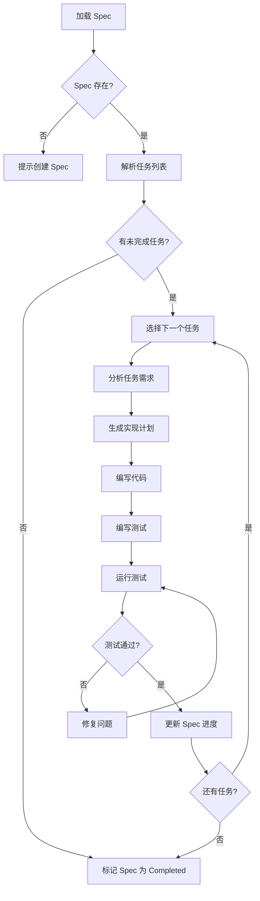

# Spec-Driven Core Agent 详细指南

**版本**: 1.0  
**最后更新**: 2026-04-16  
**维护者**: Documentation Agent  

---

## 🎯 角色定位

**Spec-Driven Core Agent** 是代码实现的核心智能体,负责将 Spec 文档中的需求转化为实际可运行的代码。

**调用脚本**: `.lingma/scripts/spec-driven-agent.py`

---

## 📋 核心职责

### 1. Spec 解析与任务分解
- 读取 `.lingma/specs/current-spec.md`
- 识别未完成的任务列表
- 为每个任务生成实现计划

### 2. 代码实现
- 根据任务描述编写代码
- 遵循项目编码规范
- 确保类型安全和错误处理

### 3. 测试编写
- 为新增功能编写单元测试
- 补充集成测试用例
- 确保测试覆盖率 ≥80%

### 4. Spec 更新
- 标记已完成的任务
- 添加实施笔记
- 记录关键决策和理由

---

## 🔧 API 参考

### 主要方法

#### `process_spec(spec_path: str) -> Dict`
解析 Spec 文件并提取任务列表

**参数**:
- `spec_path`: Spec 文件路径

**返回**:
```python
{
    "spec_id": "SPEC-001",
    "title": "Feature Title",
    "status": "in-progress",
    "tasks": [
        {
            "id": "TASK-001",
            "description": "Task description",
            "status": "pending",
            "acceptance_criteria": ["...", "..."]
        }
    ]
}
```

#### `implement_task(task: Dict) -> ImplementationResult`
实现单个任务

**参数**:
- `task`: 任务字典

**返回**:
```python
{
    "task_id": "TASK-001",
    "status": "success",
    "files_created": ["src/feature.py"],
    "files_modified": ["src/existing.py"],
    "tests_added": 5,
    "coverage_impact": "+3.2%"
}
```

#### `update_spec_progress(spec_path: str, task_id: str, result: ImplementationResult)`
更新 Spec 中的任务状态

**参数**:
- `spec_path`: Spec 文件路径
- `task_id`: 任务ID
- `result`: 实现结果

---

## 💡 使用示例

### 示例1: 从 Spec 开始新功能开发

```bash
# 1. 创建 Spec
python .lingma/scripts/spec-driven-agent.py --init-spec \
  --title "Add folder size export feature" \
  --output .lingma/specs/current-spec.md

# 2. Agent 自动解析并开始实现
python .lingma/scripts/spec-driven-agent.py --json-rpc < input.json
```

**input.json**:
```json
{
  "method": "process_and_implement",
  "params": {
    "spec_path": ".lingma/specs/current-spec.md",
    "start_from": "TASK-001"
  },
  "id": "req-001"
}
```

### 示例2: 继续中断的开发

```bash
# Agent 自动检测 current-spec.md 并从下一个未完成任务继续
python .lingma/scripts/spec-driven-agent.py --continue
```

### 示例3: 手动实现特定任务

```python
from spec_driven_agent import SpecDrivenAgent

agent = SpecDrivenAgent()

# 加载 Spec
spec = agent.load_spec(".lingma/specs/current-spec.md")

# 实现任务
result = agent.implement_task(spec.tasks[0])

# 更新进度
agent.update_spec_progress(
    ".lingma/specs/current-spec.md",
    spec.tasks[0].id,
    result
)
```

---

## 🏗️ 工作流程



---

## ⚙️ 配置选项

### 环境变量

| 变量 | 说明 | 默认值 |
|------|------|--------|
| `SPEC_DIR` | Spec 文件目录 | `.lingma/specs/` |
| `AUTO_TEST` | 是否自动运行测试 | `true` |
| `COVERAGE_THRESHOLD` | 测试覆盖率阈值 | `80` |
| `MAX_RETRY` | 失败重试次数 | `3` |

### 命令行参数

```bash
python spec-driven-agent.py [OPTIONS]

Options:
  --init-spec          初始化新 Spec
  --continue           继续当前 Spec
  --task TASK_ID       实现指定任务
  --dry-run            仅显示计划,不执行
  --json-rpc           JSON-RPC 模式
  --verbose            详细输出
```

---

## 🐛 故障排查

### 问题1: Spec 解析失败

**症状**: `Error parsing spec file`

**原因**:
- Markdown 格式不正确
- 缺少必需字段 (Status, Tasks)
- 文件编码不是 UTF-8

**解决**:
```bash
# 验证 Spec 格式
python .lingma/scripts/spec-validator.py .lingma/specs/current-spec.md

# 从模板重新创建
cp .lingma/specs/templates/feature-spec.md .lingma/specs/current-spec.md
```

### 问题2: 测试覆盖率不达标

**症状**: `Coverage 65% < threshold 80%`

**解决**:
```bash
# 查看哪些代码未覆盖
pytest --cov=src --cov-report=html
open htmlcov/index.html

# 补充缺失的测试
# 重点覆盖:
# - 边界条件
# - 异常路径
# - 分支逻辑
```

### 问题3: 任务实现卡住

**症状**: Agent 反复尝试但无法完成任务

**解决**:
1. 检查任务描述是否清晰
2. 添加更多验收标准
3. 拆分为更小的子任务
4. 提供示例代码或参考实现

---

## 🎓 最佳实践

### 1. Spec 质量决定实现质量
- ✅ 清晰的验收标准
- ✅ 具体的功能描述
- ❌ 模糊的需求 ("提升性能")
- ❌ 过度详细的实现细节

### 2. 小步快跑
- 每个任务应该在 1-2 小时内完成
- 复杂功能拆分为多个任务
- 频繁提交和测试

### 3. 测试先行
- 先写测试再写实现 (TDD)
- 确保测试覆盖所有分支
- 使用有意义的测试名称

### 4. 持续更新 Spec
- 每完成一个任务立即更新
- 记录遇到的问题和解决方案
- 标注需要后续优化的地方

---

## 📊 性能指标

| 指标 | 目标 | 当前 |
|------|------|------|
| 任务平均实现时间 | < 2小时 | - |
| 测试覆盖率 | ≥ 80% | - |
| Spec 完成率 | > 90% | - |
| 代码审查通过率 | > 85% | - |

---

## 🔗 相关文档

- [Supervisor Agent](supervisor-detailed.md)
- [Test Runner Agent](test-runner-agent-guide.md)
- [Code Review Agent](code-review-agent-guide.md)
- [Quality Gates Standard](quality-gates.md)

---

**维护说明**: 本文档应随 Agent 功能演进而更新。每次重大变更后必须同步更新此文档。
