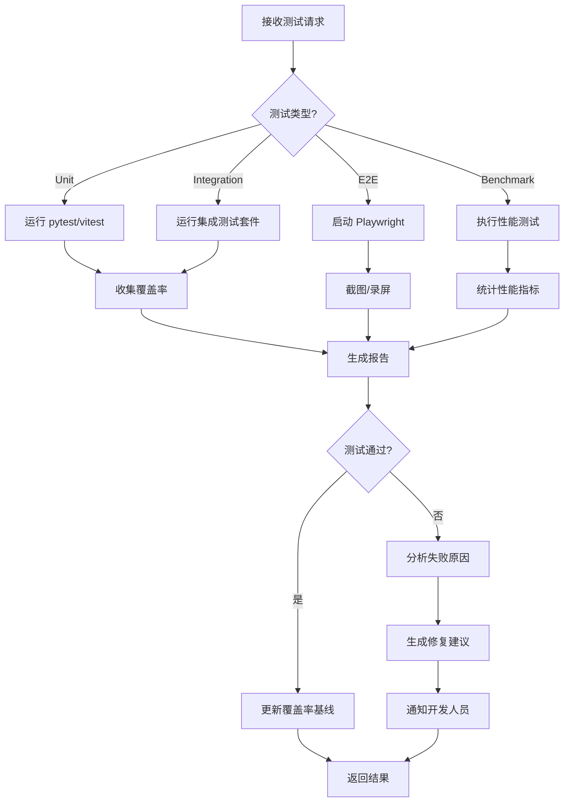

# Test Runner Agent 详细指南

**版本**: 1.0  
**最后更新**: 2026-04-16  
**维护者**: Documentation Agent  

---

## 🎯 角色定位

**Test Runner Agent** 是自动化测试执行和分析的智能体,负责运行单元测试、集成测试和 E2E 测试,并提供详细的测试报告和质量分析。

**调用脚本**: `.lingma/scripts/test-runner.py`

---

## 📋 核心职责

### 1. 测试执行
- 运行 Python 单元测试 (pytest)
- 运行 TypeScript 测试 (vitest/jest)
- 运行 Rust 测试 (cargo test)
- 运行 E2E 测试 (Playwright)

### 2. 覆盖率分析
- 收集代码覆盖率数据
- 生成 HTML/XML 报告
- 对比历史覆盖率趋势

### 3. 性能基准测试
- 执行性能基准测试
- 检测性能回归
- 生成性能报告

### 4. 测试结果分析
- 识别失败的根本原因
- 分类测试失败类型
- 提供修复建议

---

## 🔧 API 参考

### 主要方法

#### `run_tests(test_config: TestConfig) -> TestResult`
执行测试套件

**参数**:
```python
TestConfig(
    test_type: str,  # "unit" | "integration" | "e2e" | "benchmark"
    target_dir: str,
    coverage_enabled: bool = True,
    parallel: bool = False,
    timeout_seconds: int = 300
)
```

**返回**:
```python
TestResult(
    status: str,  # "passed" | "failed" | "partial"
    total_tests: int,
    passed: int,
    failed: int,
    skipped: int,
    duration_seconds: float,
    coverage: CoverageReport,
    failures: List[TestFailure]
)
```

#### `analyze_failures(failures: List[TestFailure]) -> AnalysisReport`
分析测试失败原因

**返回**:
```python
AnalysisReport(
    root_causes: List[str],
    recommendations: List[str],
    estimated_fix_time: str,
    related_issues: List[str]
)
```

#### `compare_coverage(current: CoverageReport, baseline: CoverageReport) -> CoverageDiff`
对比覆盖率变化

**返回**:
```python
CoverageDiff(
    line_coverage_change: float,  # +3.2 or -1.5
    branch_coverage_change: float,
    new_uncovered_lines: List[str],
    improved_areas: List[str]
)
```

---

## 💡 使用示例

### 示例1: 运行单元测试

```bash
python .lingma/scripts/test-runner.py --json-rpc <<EOF
{
  "method": "run_tests",
  "params": {
    "test_type": "unit",
    "target_dir": ".lingma/scripts/",
    "coverage_enabled": true,
    "parallel": true
  },
  "id": "test-001"
}
EOF
```

### 示例2: 运行 E2E 测试

```bash
python .lingma/scripts/test-runner.py --type e2e --headless
```

### 示例3: 性能基准测试

```python
from test_runner import TestRunnerAgent

agent = TestRunnerAgent()

config = TestConfig(
    test_type="benchmark",
    target_dir="src/utils/",
    iterations=100
)

result = agent.run_benchmark(config)
print(f"Avg execution time: {result.avg_time_ms}ms")
print(f"P95 latency: {result.p95_latency_ms}ms")
```

### 示例4: 分析测试失败

```python
failures = agent.get_recent_failures(limit=10)
analysis = agent.analyze_failures(failures)

print("Root causes:")
for cause in analysis.root_causes:
    print(f"  - {cause}")

print("\nRecommendations:")
for rec in analysis.recommendations:
    print(f"  - {rec}")
```

---

## 🏗️ 工作流程



---

## ⚙️ 配置选项

### pytest 配置 (pytest.ini)

```ini
[pytest]
testpaths = tests
python_files = test_*.py
python_classes = Test*
python_functions = test_*
addopts = 
    --verbose
    --cov=.lingma/scripts
    --cov-report=html:htmlcov
    --cov-report=xml:coverage.xml
    --junitxml=junit-results.xml
    --maxfail=5
    --tb=short
```

### Playwright 配置 (playwright.config.ts)

```typescript
import { defineConfig } from '@playwright/test';

export default defineConfig({
  testDir: './tests/e2e',
  timeout: 30000,
  expect: {
    timeout: 5000
  },
  use: {
    headless: true,
    screenshot: 'only-on-failure',
    video: 'retain-on-failure'
  },
  reporter: [
    ['html'],
    ['junit', { outputFile: 'junit-results.xml' }]
  ]
});
```

### 环境变量

| 变量 | 说明 | 默认值 |
|------|------|--------|
| `TEST_TIMEOUT` | 测试超时时间(秒) | `300` |
| `COVERAGE_THRESHOLD` | 覆盖率阈值(%) | `80` |
| `PARALLEL_WORKERS` | 并行工作线程数 | `auto` |
| `PLAYWRIGHT_HEADLESS` | E2E 无头模式 | `true` |

---

## 📊 测试报告格式

### JSON 报告示例

```json
{
  "test_run_id": "run-20260416-001",
  "timestamp": "2026-04-16T15:30:00Z",
  "test_type": "unit",
  "summary": {
    "total": 156,
    "passed": 152,
    "failed": 3,
    "skipped": 1,
    "duration_seconds": 42.5
  },
  "coverage": {
    "line": 85.2,
    "branch": 72.8,
    "function": 88.5,
    "statement": 84.1
  },
  "failures": [
    {
      "test_name": "test_folder_size_calculation",
      "file": "tests/test_utils.py",
      "line": 45,
      "error": "AssertionError: Expected 1024, got 1020",
      "traceback": "...",
      "severity": "high"
    }
  ],
  "performance": {
    "avg_test_duration_ms": 272,
    "slowest_tests": [
      {
        "name": "test_large_folder_scan",
        "duration_ms": 3500
      }
    ]
  }
}
```

---

## 🐛 故障排查

### 问题1: 测试超时

**症状**: `TimeoutError: Test exceeded 300s limit`

**原因**:
- 测试中有无限循环
- 外部依赖响应慢
- 资源竞争导致死锁

**解决**:
```python
# 1. 增加超时时间
@pytest.mark.timeout(600)
def test_slow_operation():
    ...

# 2. 使用 mock 替代慢速依赖
@patch('external_api.call')
def test_with_mock(mock_call):
    mock_call.return_value = {"status": "ok"}
    ...

# 3. 优化测试逻辑
# - 减少不必要的数据准备
# - 并行化独立测试
# - 使用 fixtures 共享 setup
```

### 问题2: Flaky Tests (不稳定测试)

**症状**: 同一测试有时通过有时失败

**常见原因**:
- 竞态条件
- 依赖外部服务
- 时间相关的断言
- 随机数据

**解决**:
```python
# 1. 修复竞态条件
import asyncio

async def test_async_operation():
    result = await async_function()
    assert result == expected

# 2. Mock 外部依赖
@patch('requests.get')
def test_api_call(mock_get):
    mock_get.return_value.status_code = 200
    ...

# 3. 避免时间依赖
# ❌ 不好
assert datetime.now().hour == 12

# ✅ 好
with freeze_time("2026-04-16 12:00:00"):
    assert get_current_hour() == 12

# 4. 固定随机种子
import random
random.seed(42)
```

### 问题3: 覆盖率下降

**症状**: `Coverage dropped from 85% to 78%`

**解决**:
```bash
# 1. 查看哪些代码未覆盖
pytest --cov=src --cov-report=term-missing

# 2. 重点关注:
#    - 新增的功能代码
#    - 修改的逻辑分支
#    - 异常处理路径

# 3. 补充测试
# - 边界条件测试
# - 错误处理测试
# - 集成场景测试
```

---

## 🎓 最佳实践

### 1. 测试金字塔
```
       /\
      /E2E\      少量 E2E 测试 (10%)
     /------\
    /Integ  \    适量集成测试 (20%)
   /----------\
  /   Unit     \  大量单元测试 (70%)
 /--------------\
```

### 2. AAA 模式
```python
def test_addition():
    # Arrange - 准备
    calculator = Calculator()
    
    # Act - 执行
    result = calculator.add(2, 3)
    
    # Assert - 断言
    assert result == 5
```

### 3. 测试命名规范
```python
# ✅ 好: 清晰表达测试意图
def test_calculate_folder_size_returns_bytes_for_empty_folder():
    ...

# ❌ 不好: 含义不明
def test_func1():
    ...
```

### 4. 使用 Fixtures
```python
@pytest.fixture
def sample_folder(tmp_path):
    """创建测试文件夹结构"""
    folder = tmp_path / "test_folder"
    folder.mkdir()
    (folder / "file1.txt").write_text("content")
    return folder

def test_folder_size(sample_folder):
    size = calculate_size(sample_folder)
    assert size > 0
```

### 5. 参数化测试
```python
@pytest.mark.parametrize("input,expected", [
    (0, "0 B"),
    (1024, "1 KB"),
    (1048576, "1 MB"),
    (1073741824, "1 GB"),
])
def test_format_bytes(input, expected):
    assert format_bytes(input) == expected
```

---

## 📈 性能指标

| 指标 | 目标 | 当前 |
|------|------|------|
| 单元测试执行时间 | < 60s | - |
| E2E 测试执行时间 | < 5min | - |
| 测试覆盖率 | ≥ 80% | - |
| Flaky tests 比例 | < 1% | - |
| 测试通过率 | > 95% | - |

---

## 🔗 相关文档

- [Quality Gates Standard](quality-gates.md)
- [CI/CD Pipeline Configuration](../guides/ci-cd-setup.md)
- [Testing Best Practices](../guides/testing-best-practices.md)

---

**维护说明**: 本文档应随测试框架演进而更新。每次添加新的测试工具或改变测试策略时必须同步更新。
