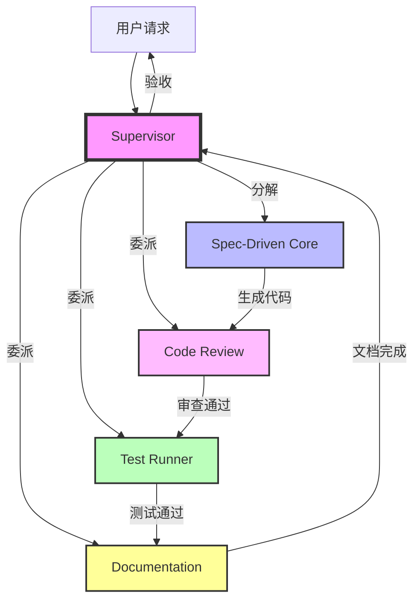

# 架构设计专家分析报告

## 审查维度
- 职责划分清晰度
- 协作机制合理性
- 系统边界定义
- 扩展性设计
- 依赖关系管理

## 整体架构评估

### 架构模式识别
当前系统采用**Supervisor-Worker模式**：
```
Supervisor Agent (编排层)
    ├── Spec-Driven Core Agent (需求管理层)
    ├── Test Runner Agent (质量保障层)
    ├── Code Review Agent (代码审查层)
    └── Documentation Agent (文档同步层)
```

✅ **优点**:
1. 单一职责原则(SRP)得到良好体现
2. 关注点分离清晰
3. 易于横向扩展新Worker

⚠️ **风险**:
1. Supervisor成为单点故障(SPOF)
2. Worker间缺乏直接通信机制
3. 缺少事件总线或消息队列抽象

## 职责划分分析

### 1. Supervisor Agent
**职责范围**: 任务分解、委派、质量门禁、最终验收

**边界清晰度**: ⭐⭐⭐⭐☆ (4/5)

**问题**:
- 同时承担"编排"和"验收"两个职责，违反单一职责
- 质量门禁逻辑硬编码在Agent定义中，应抽离为独立组件

**建议**:
```
拆分方案:
- Supervisor Agent: 仅负责任务分解和委派
- Quality Gate Manager: 专门负责5层门禁执行
- Acceptance Agent: 负责最终验收
```

### 2. Spec-Driven Core Agent
**职责范围**: Spec管理、任务分解、自主执行

**边界清晰度**: ⭐⭐⭐☆☆ (3/5)

**问题**:
- "任务分解"与Supervisor的职责重叠
- "自主执行"边界模糊，可能与其它Worker冲突

**澄清需求**:
- Q: Spec-Driven Core Agent分解的任务粒度？
- Q: 它与Supervisor分解的任务有何区别？
- Q: "自主执行"是否意味着可以绕过质量门禁？

**建议**:
明确层级关系：
```
Level 1: Supervisor分解用户请求 → 宏观任务
Level 2: Spec-Driven Core分解Spec → 开发任务
Level 3: Workers执行具体任务 → 原子操作
```

### 3. Test Runner Agent
**职责范围**: 测试执行、失败分析、诊断

**边界清晰度**: ⭐⭐⭐⭐⭐ (5/5)

**评价**: 职责聚焦，边界清晰

**改进建议**:
- 增加"测试选择"能力（基于变更影响分析）
- 与Code Review Agent集成（测试覆盖率作为质量指标）

### 4. Code Review Agent
**职责范围**: 质量检查、安全扫描、性能分析

**边界清晰度**: ⭐⭐⭐⭐☆ (4/5)

**问题**:
- "自动修复"能力与"审查"角色存在角色冲突
- 审查者不应同时是修复者（利益冲突）

**建议**:
- 移除"自动修复"能力，改为"生成修复补丁"
- 由Spec-Driven Core Agent应用补丁

### 5. Documentation Agent
**职责范围**: 文档生成、更新、质量检查

**边界清晰度**: ⭐⭐⭐⭐⭐ (5/5)

**评价**: 职责纯粹，无越界

**改进建议**:
- 增加"文档版本控制"能力
- 与Git Hook集成实现自动触发

## 协作机制评估

### 当前协作模式
通过Supervisor的TaskQueue和AgentClient进行间接协作

**问题**:
1. **同步阻塞**: Sequential模式下，后续Worker必须等待前一个完成
2. **状态共享**: 缺少共享状态管理机制
3. **错误传播**: 一个Worker失败如何通知其他相关Worker？

**建议架构改进**:

#### 方案A: 引入事件总线
```
Event Bus (RabbitMQ/Kafka/Redis PubSub)
    ├── TaskCreated Event
    ├── TaskCompleted Event
    ├── TaskFailed Event
    └── QualityGatePassed Event

Workers订阅相关事件，实现解耦
```

#### 方案B: 共享状态存储
```
State Store (Redis/Database)
    ├── Task State Machine
    ├── Artifact Registry
    └── Dependency Graph

所有Worker读写统一状态，避免竞态条件
```

#### 方案C: 混合模式（推荐）
```
- 轻量级任务用Event Bus异步通知
- 重量级状态用State Store持久化
- Supervisor作为协调者而非控制器
```

## 扩展性分析

### 水平扩展能力
✅ **优势**:
- Worker注册机制清晰（通过name字段）
- 新增Worker只需在Supervisor的"可用Workers"列表中添加

⚠️ **限制**:
- Supervisor需要硬编码Worker调用逻辑
- 缺少动态发现和负载均衡

**建议**:
实现Worker注册表(Worker Registry):
```yaml
# .lingma/config/workers.yaml
workers:
  - name: code-review-agent
    script: .lingma/scripts/code-reviewer.py
    capabilities: [quality, security, performance]
    max_concurrent: 3
    timeout: 300s
    
  - name: test-runner-agent
    script: .lingma/scripts/test-runner.py
    capabilities: [unit-test, integration-test, e2e-test]
    max_concurrent: 5
    timeout: 600s
```

### 垂直扩展能力
⚠️ **问题**:
- 缺少Worker优先级调度
- 无法根据负载动态调整并发数

**建议**:
引入资源配额管理:
```
Resource Quota per Worker:
  - CPU: 2 cores max
  - Memory: 4GB max
  - Disk I/O: 100MB/s max
```

## 依赖关系图



**发现的问题**:
- 依赖关系是线性的，缺乏并行优化空间
- 缺少反馈循环（如测试失败后如何触发重新编码）

## 架构成熟度评分

| 维度 | 评分 | 说明 |
|------|------|------|
| 职责划分 | 80/100 | 大部分清晰，但有重叠 |
| 协作机制 | 65/100 | 过于依赖Supervisor，耦合度高 |
| 扩展性 | 70/100 | 支持新增Worker，但调度能力弱 |
| 容错性 | 60/100 | 缺少降级和熔断机制 |
| 可观测性 | 55/100 | 仅有决策日志，缺少Metrics/Tracing |

**综合评分**: 66/100 ⚠️ (需要改进)

## 架构演进路线

### Phase 1: 解耦（1个月）
- 引入事件总线
- 将质量门禁逻辑从Supervisor抽离
- 实现Worker注册表

### Phase 2: 弹性（2个月）
- 实现动态负载均衡
- 添加熔断器和重试策略
- 引入分布式追踪

### Phase 3: 智能化（3个月）
- 基于历史的智能任务路由
- 自适应并发控制
- 预测性资源分配

---
*生成时间: 2026-04-18*
*分析师: Architecture Design Expert Agent*
