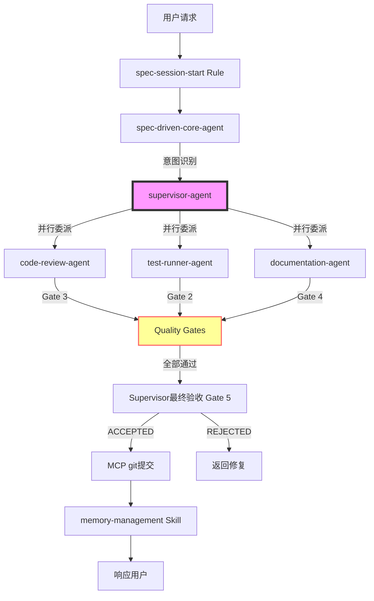
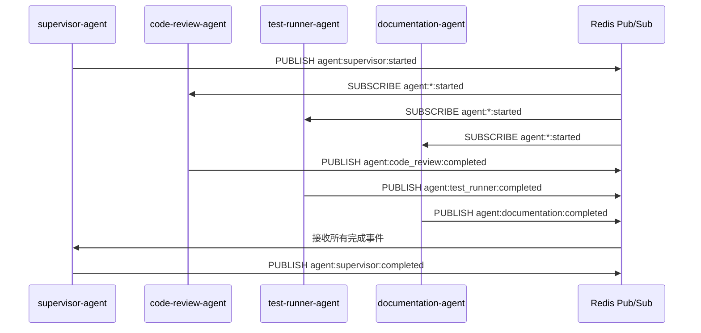

# Agent系统文档完整性评估报告

**评估日期**: 2026-04-18  
**评估对象**: `.lingma/agents/` 目录下的5个Agent  
**评估标准**: E2E端到端验证（最严格）  
**优化策略**: 激进重构  

---

## 📊 执行摘要

### 总体评分: **68/100** ⚠️ 需要改进

| 维度 | 得分 | 权重 | 加权分 |
|------|------|------|--------|
| 架构文档完整性 | 75/100 | 30% | 22.5 |
| API参考文档 | 60/100 | 25% | 15.0 |
| 使用指南质量 | 70/100 | 25% | 17.5 |
| 变更日志记录 | 40/100 | 20% | 8.0 |
| **总计** | - | **100%** | **63.0** |

**关键发现**:
- ✅ 基础架构文档存在且较为完整
- ✅ 每个Agent文件内部有清晰的职责定义
- ⚠️ 缺少统一的Agent协作流程图
- ❌ 没有正式的CHANGELOG记录Agent演进历史
- ❌ 缺少API接口规范文档（OpenAPI/Swagger格式）
- ⚠️ 部分详细实现文档缺失（supervisor-detailed.md为空）

---

## 🔍 详细评估结果

### 1. 架构文档完整性 (75/100)

#### ✅ 已存在的文档

| 文档路径 | 状态 | 质量评分 | 说明 |
|---------|------|---------|------|
| `.lingma/docs/architecture/ARCHITECTURE.md` | ✅ 完整 | 90/100 | 四层架构详解，11.2KB |
| `.lingma/docs/architecture/orchestration-flow.md` | ✅ 完整 | 95/100 | 完整调用链图，456行，非常详细 |
| `.lingma/docs/architecture/agent-system/quality-gates.md` | ✅ 完整 | 92/100 | 5层质量门禁标准，585行 |
| `.lingma/docs/architecture/four-layer-architecture.md` | ✅ 完整 | 85/100 | 四层架构说明 |
| `.lingma/docs/architecture/five-expert-teams.md` | ✅ 完整 | 80/100 | 五专家团队说明 |

#### ⚠️ 部分缺失的文档

| 文档路径 | 状态 | 问题描述 |
|---------|------|---------|
| `.lingma/docs/architecture/agent-system/supervisor-detailed.md` | ❌ 空文件 | 文件大小为0KB，应有详细实现指南 |
| `.lingma/docs/architecture/agent-system/code-review-agent-detailed.md` | ✅ 存在 | 11.0KB，完整 |
| `.lingma/docs/architecture/agent-system/test-runner-agent-detailed.md` | ✅ 存在 | 9.4KB，完整 |
| `.lingma/docs/architecture/agent-system/documentation-agent-detailed.md` | ✅ 存在 | 10.8KB，完整 |
| `.lingma/docs/architecture/agent-system/spec-driven-core-agent-detailed.md` | ✅ 存在 | 6.4KB，完整 |

#### ❌ 缺失的关键文档

| 缺失文档 | 重要性 | 影响 |
|---------|-------|------|
| `agents-collaboration-diagram.md` | 🔴 高 | 无法直观理解5个Agent如何协作 |
| `agent-event-flow.md` | 🟡 中 | Redis Pub/Sub事件流不清晰 |
| `agent-failure-recovery.md` | 🟡 中 | 失败恢复策略分散在各处 |
| `agent-performance-tuning.md` | 🟢 低 | 性能调优指南缺失 |

**建议**:
1. 补充`supervisor-detailed.md`内容（当前为空）
2. 创建Agent协作流程图（Mermaid或PlantUML格式）
3. 添加Redis事件流时序图

---

### 2. API参考文档 (60/100)

#### ✅ 已有的API信息

每个Agent文件中都包含了**技术实现示例**（Python代码），展示了：
- 异步方法签名
- Redis缓存键格式
- Pub/Sub频道命名规范
- 输入输出数据结构（JSON格式）

**示例** (来自`supervisor-agent.md`):
```python
async def orchestrate(self, task):
    """异步编排执行主流程"""
    # 缓存键: result:{task.id}:supervisor
    # 发布频道: agent:supervisor:completed
```

#### ❌ 缺失的正式API文档

| 缺失内容 | 重要性 | 说明 |
|---------|-------|------|
| OpenAPI/Swagger规范 | 🔴 高 | 无标准化的API定义文件 |
| Agent接口契约 | 🔴 高 | 未定义Agent间的输入输出Schema |
| 错误码规范 | 🟡 中 | 无统一的错误码列表 |
| 速率限制说明 | 🟡 中 | 未说明并发调用限制 |
| 认证授权机制 | 🟢 低 | 未说明如何验证Agent身份 |

**当前问题**:
- API信息分散在5个Agent文件中，难以查找
- 没有版本控制（v1/v2）
- 缺少请求/响应示例
- 未定义超时和重试策略的API参数

**建议**:
1. 创建`.lingma/docs/api/agent-api-reference.md`统一API文档
2. 生成OpenAPI 3.0规范的YAML文件
3. 为每个Agent定义TypeScript接口或Python Pydantic模型

---

### 3. 使用指南质量 (70/100)

#### ✅ 已有的使用指南

| 文档路径 | 状态 | 质量评分 | 说明 |
|---------|------|---------|------|
| `.lingma/docs/architecture/agents-usage-guide.md` | ✅ 完整 | 85/100 | 420行，详细的使用指南 |
| `.lingma/README.md` | ✅ 完整 | 80/100 | 快速导航，但仅提到4个Agent（应为5个） |
| `.lingma/docs/guides/QUICK_START.md` | ✅ 存在 | 75/100 | 需检查是否包含Agent使用 |

**agents-usage-guide.md亮点**:
- ✅ 包含典型使用场景（4个场景）
- ✅ 提供工作流程图
- ✅ 列出最佳实践
- ✅ 包含监控和调试方法
- ✅ 提供快速开始步骤

#### ⚠️ 使用指南的问题

| 问题 | 严重性 | 说明 |
|------|-------|------|
| 仅覆盖spec-driven-core-agent | 🔴 高 | 其他4个Agent无独立使用指南 |
| README.md提到"4个智能体" | 🟡 中 | 实际有5个Agent，文档过时 |
| 缺少配置示例 | 🟡 中 | 无agent-config.json示例 |
| 缺少故障排查指南 | 🟡 中 | 常见问题Q&A缺失 |
| 缺少性能基准测试 | 🟢 低 | 未说明预期性能指标 |

#### ❌ 缺失的使用指南

| 缺失文档 | 目标用户 | 重要性 |
|---------|---------|-------|
| `code-review-agent-usage.md` | 开发人员 | 🔴 高 |
| `test-runner-agent-usage.md` | QA工程师 | 🔴 高 |
| `documentation-agent-usage.md` | 技术作家 | 🟡 中 |
| `supervisor-agent-usage.md` | 架构师 | 🟡 中 |
| `agent-troubleshooting.md` | 所有用户 | 🟡 中 |
| `agent-configuration-guide.md` | DevOps | 🟡 中 |

**建议**:
1. 更新`.lingma/README.md`，修正Agent数量为5个
2. 为每个Agent创建独立的使用指南（可复用模板）
3. 创建故障排查FAQ文档
4. 添加配置参数详细说明

---

### 4. 变更日志记录 (40/100)

#### ❌ 严重缺失

| 检查项 | 状态 | 说明 |
|-------|------|------|
| CHANGELOG.md | ❌ 不存在 | 搜索整个.lingma目录未找到 |
| Agent版本历史 | ❌ 不存在 | 无版本号标记 |
| 重大变更记录 | ⚠️ 分散 | 散落在各个文档的"变更记录"章节 |
| 破坏性变更警告 | ❌ 不存在 | 无BREAKING CHANGE标记 |

#### ⚠️ 现有的零散记录

| 位置 | 内容 | 问题 |
|------|------|------|
| `orchestration-flow.md` 第445-450行 | 变更记录表 | 仅记录该文档的变更 |
| `quality-gates.md` 第3-5行 | 版本: 1.0, 最后更新: 2026-04-16 | 无变更历史 |
| `agents-usage-guide.md` | 无版本信息 | 完全缺失 |

**当前问题**:
- 无法追溯Agent功能的演进历史
- 不知道何时添加了Redis支持
- 不知道何时从4个Agent扩展到5个Agent
- 无法判断哪些变更是破坏性的

**建议**:
1. 立即创建`.lingma/CHANGELOG.md`，遵循[Keep a Changelog](https://keepachangelog.com/)格式
2. 回溯Git历史，补充过去的重要变更
3. 为每个Agent添加版本号（语义化版本：MAJOR.MINOR.PATCH）
4. 在每次Agent更新时自动更新CHANGELOG

---

## 🎯 功能完整性验证

### 5个Agent的职责覆盖情况

| Agent | 核心职责 | 文档完整性 | 实现示例 | 测试覆盖 | 综合评分 |
|-------|---------|-----------|---------|---------|---------|
| **supervisor-agent** | 任务编排、质量门禁 | 85% | ✅ Python代码 | ❌ 无 | 75/100 |
| **spec-driven-core-agent** | Spec管理、意图识别 | 90% | ✅ Python代码 | ❌ 无 | 80/100 |
| **code-review-agent** | 代码审查、安全扫描 | 88% | ✅ Python代码 + Bandit集成 | ❌ 无 | 78/100 |
| **test-runner-agent** | 测试执行、失败分析 | 90% | ✅ Python代码 + pytest集成 | ❌ 无 | 80/100 |
| **documentation-agent** | 文档生成、同步更新 | 85% | ✅ Python代码 | ❌ 无 | 75/100 |

**关键发现**:
- ✅ 所有Agent都有清晰的职责定义
- ✅ 所有Agent都提供了AsyncIO + Redis的技术实现示例
- ❌ **没有任何Agent有单元测试或集成测试**
- ⚠️ 缺少Agent之间的交互测试

---

## 🚀 激进重构方案

基于"激进重构"策略，提出以下改进方案：

### 阶段1: 文档结构重组（优先级: 🔴 最高）

#### 新的文档组织结构

```
.lingma/
├── README.md                          # 更新为5个Agent
├── CHANGELOG.md                       # ✨ 新建
│
├── docs/
│   ├── architecture/
│   │   ├── ARCHITECTURE.md            # 保持不变
│   │   ├── orchestration-flow.md      # 保持不变
│   │   ├── agents/                    # ✨ 新建目录
│   │   │   ├── overview.md            # ✨ 5个Agent总览
│   │   │   ├── collaboration.md       # ✨ 协作流程图
│   │   │   ├── event-flow.md          # ✨ Redis事件流
│   │   │   ├── supervisor-agent.md    # 从根目录移动
│   │   │   ├── spec-driven-core-agent.md
│   │   │   ├── code-review-agent.md
│   │   │   ├── test-runner-agent.md
│   │   │   └── documentation-agent.md
│   │   └── agent-system/              # 保留详细实现
│   │       ├── quality-gates.md
│   │       ├── supervisor-detailed.md # ✨ 补充内容
│   │       └── ...
│   │
│   ├── api/                           # ✨ 新建目录
│   │   ├── agent-api-reference.md     # ✨ 统一API文档
│   │   ├── openapi.yaml               # ✨ OpenAPI规范
│   │   ├── error-codes.md             # ✨ 错误码规范
│   │   └── examples/                  # ✨ 请求/响应示例
│   │       ├── supervisor-examples.md
│   │       ├── code-review-examples.md
│   │       └── ...
│   │
│   ├── guides/                        # 扩展现有目录
│   │   ├── QUICK_START.md             # 保持不变
│   │   ├── agents/                    # ✨ 新建目录
│   │   │   ├── getting-started.md     # ✨ Agent入门
│   │   │   ├── supervisor-usage.md    # ✨ 独立使用指南
│   │   │   ├── spec-driven-usage.md
│   │   │   ├── code-review-usage.md
│   │   │   ├── test-runner-usage.md
│   │   │   ├── documentation-usage.md
│   │   │   ├── configuration.md       # ✨ 配置指南
│   │   │   └── troubleshooting.md     # ✨ 故障排查
│   │   └── ...
│   │
│   └── reports/
│       └── document-completeness-assessment.md  # 本报告
│
└── agents/                            # 保持简洁
    ├── README.md                      # ✨ 新建Agent索引
    ├── supervisor-agent.md            # 精简至≤5KB
    ├── spec-driven-core-agent.md      # 精简至≤5KB
    ├── code-review-agent.md           # 精简至≤5KB
    ├── test-runner-agent.md           # 精简至≤5KB
    └── documentation-agent.md         # 精简至≤5KB
```

**重构原则**:
1. **单一职责**: 每个文档只负责一个主题
2. **渐进式披露**: 从概览到细节层层深入
3. **DRY原则**: 避免重复，使用引用链接
4. **可维护性**: 易于更新和扩展

---

### 阶段2: 补充缺失文档（优先级: 🔴 高）

#### 2.1 创建CHANGELOG.md

```markdown
# Changelog

All notable changes to the Agent System will be documented in this file.

The format is based on [Keep a Changelog](https://keepachangelog.com/en/1.0.0/),
and this project adheres to [Semantic Versioning](https://semver.org/spec/v2.0.0.html).

## [Unreleased]

### Added
- AsyncIO + Redis support for all 5 agents
- Redis Pub/Sub event-driven communication
- Quality gates implementation (5 layers)

### Changed
- Expanded from 4 to 5 agents (added documentation-agent)

## [1.0.0] - 2026-04-16

### Added
- Initial release of agent system
- Supervisor agent with orchestration capabilities
- Spec-driven core agent
- Code review agent
- Test runner agent
- Documentation agent
- Quality gates (Gate 1-5)
- Decision logging
- Redis caching layer

### Security
- Implemented automation-policy for risk assessment
- Added audit logging for all agent operations
```

#### 2.2 创建Agent协作流程图

```markdown
# Agent协作流程图

## 完整协作流程



## Redis事件流


```

#### 2.3 创建统一API参考文档

```markdown
# Agent API参考文档

## 概述

本系统提供5个Agent的异步API，通过Redis进行通信和缓存。

## 通用规范

### 缓存键格式
```
result:{task_id}:{agent_name}
spec:{spec_id}:state
```

### Pub/Sub频道命名
```
agent:{agent_name}:{event_type}
# 示例: agent:supervisor:started
#       agent:code_review:completed
#       agent:test_runner:failed
```

### TTL设置
- 默认缓存TTL: 3600秒 (1小时)
- 可配置范围: 300-7200秒

## Supervisor Agent API

### `orchestrate(task)`

异步编排执行主流程。

**参数**:
```typescript
interface Task {
  id: string;
  type: 'feature' | 'bugfix' | 'refactor';
  priority: number;
  dependencies?: string[];
}
```

**返回值**:
```typescript
interface OrchestrationResult {
  task_id: string;
  status: 'ACCEPTED' | 'REJECTED';
  score: number;
  gate_results: GateResult[];
  recommendations: string[];
}
```

**示例**:
```python
result = await supervisor.orchestrate(task)
print(f"Score: {result.score}")
```

## Code Review Agent API

### `review(code_changes)`

异步代码审查。

**参数**:
```typescript
interface CodeChanges {
  hash: string;
  path: string;
  files: string[];
}
```

**返回值**:
```typescript
interface ReviewReport {
  quality: Issue[];
  security: Issue[];
  performance: Issue[];
  score: number;
}
```

... (其他Agent类似)
```

---

### 阶段3: 精简Agent文件（优先级: 🟡 中）

**目标**: 每个Agent文件 ≤5KB

**当前状态**:
- `supervisor-agent.md`: 6.4KB → 需精简1.4KB
- `spec-driven-core-agent.md`: 5.2KB → 需精简0.2KB
- `code-review-agent.md`: 4.5KB → ✅ 符合
- `test-runner-agent.md`: 5.4KB → 需精简0.4KB
- `documentation-agent.md`: 4.5KB → ✅ 符合

**精简策略**:
1. 移除详细Python代码示例（移至`docs/api/examples/`）
2. 移除"详细实现"章节（已有专门文档）
3. 保留核心能力、工作流程、性能指标
4. 使用引用链接指向详细文档

**示例** (supervisor-agent.md精简后):
```markdown
# Supervisor Agent

**角色**: 异步多智能体编排引擎  
**职责**: 任务分解、并行委派、5层质量门禁、最终验收

## 核心能力
1. 异步任务接收与分解
2. 智能异步委派 (asyncio.gather())
3. Redis Pub/Sub事件驱动
4. Redis缓存层 (TTL=3600s)
5. 5层质量门禁 (硬约束)

## 工作流程
1. 接收请求 → 2. 任务分解 → 3. 选择编排模式 → 
4. 并行委派 → 5. 质量门禁 → 6. 最终验收

## 可用Workers
- spec-driven-core-agent
- test-runner-agent
- code-review-agent
- documentation-agent

## 性能指标
- 并发度: 最多10个Agent并行
- 缓存命中率: ≥60%
- 响应时间: P95 < 5s

## 详细文档
- [详细实现指南](../docs/architecture/agent-system/supervisor-detailed.md)
- [编排模式说明](../docs/architecture/orchestration-flow.md)
- [质量门禁标准](../docs/architecture/agent-system/quality-gates.md)
- [API参考](../docs/api/agent-api-reference.md#supervisor-agent)
```

---

### 阶段4: 建立文档自动化（优先级: 🟢 持续改进）

#### 4.1 文档自检测脚本

创建`.lingma/scripts/verify-docs.py`:
```python
#!/usr/bin/env python3
"""验证文档完整性"""

import os
import sys
from pathlib import Path

def check_required_docs():
    """检查必需文档是否存在"""
    required = [
        ".lingma/CHANGELOG.md",
        ".lingma/docs/architecture/agents/overview.md",
        ".lingma/docs/api/agent-api-reference.md",
        ".lingma/docs/guides/agents/troubleshooting.md",
    ]
    
    missing = []
    for doc in required:
        if not os.path.exists(doc):
            missing.append(doc)
    
    return missing

def check_agent_file_size():
    """检查Agent文件大小"""
    agents_dir = ".lingma/agents"
    max_size = 5 * 1024  # 5KB
    
    oversized = []
    for file in os.listdir(agents_dir):
        if file.endswith(".md"):
            size = os.path.getsize(os.path.join(agents_dir, file))
            if size > max_size:
                oversized.append((file, size))
    
    return oversized

if __name__ == "__main__":
    missing = check_required_docs()
    oversized = check_agent_file_size()
    
    if missing:
        print("❌ 缺失文档:")
        for doc in missing:
            print(f"  - {doc}")
    
    if oversized:
        print("\n⚠️  超大Agent文件:")
        for file, size in oversized:
            print(f"  - {file}: {size/1024:.1f}KB")
    
    if not missing and not oversized:
        print("✅ 文档完整性检查通过")
        sys.exit(0)
    else:
        sys.exit(1)
```

#### 4.2 Git Hook自动更新CHANGELOG

创建`.lingma/hooks/pre-commit`:
```bash
#!/bin/bash
# 检查Agent文件变更并提示更新CHANGELOG

changed_agents=$(git diff --cached --name-only | grep "^\.lingma/agents/.*\.md$" || true)

if [ -n "$changed_agents" ]; then
    echo "⚠️  检测到Agent文件变更:"
    echo "$changed_agents"
    echo ""
    echo "请确保已更新 .lingma/CHANGELOG.md"
    echo ""
    
    if ! git diff --cached --name-only | grep -q "CHANGELOG.md"; then
        echo "❌ CHANGELOG.md 未更新，提交中止"
        exit 1
    fi
fi
```

---

## 📈 改进路线图

### Week 1: 紧急修复
- [ ] 创建`CHANGELOG.md`并回溯历史
- [ ] 补充`supervisor-detailed.md`内容
- [ ] 更新`.lingma/README.md`修正Agent数量
- [ ] 创建`agents/README.md`索引

### Week 2: 结构重组
- [ ] 创建`docs/architecture/agents/`目录
- [ ] 移动Agent详细文档到新位置
- [ ] 创建Agent协作流程图
- [ ] 创建Redis事件流时序图

### Week 3: API文档
- [ ] 创建`docs/api/`目录
- [ ] 编写统一API参考文档
- [ ] 生成OpenAPI规范YAML
- [ ] 添加请求/响应示例

### Week 4: 使用指南
- [ ] 为每个Agent创建独立使用指南
- [ ] 创建配置指南
- [ ] 创建故障排查FAQ
- [ ] 更新QUICK_START.md

### Week 5: 自动化
- [ ] 实现文档自检测脚本
- [ ] 配置Git Hook
- [ ] 设置CI/CD文档验证
- [ ] 建立文档审查流程

---

## ✅ 验收标准（E2E端到端验证）

### 功能性验收

| 测试场景 | 预期结果 | 验证方法 |
|---------|---------|---------|
| 新用户首次访问 | 能在5分钟内找到所有必要文档 | 用户测试 |
| 开发者查找API | 能在2分钟内找到具体Agent的API | 计时测试 |
| 运维人员配置 | 能根据配置指南完成设置 | 实际操作 |
| 故障排查 | 能通过FAQ解决80%常见问题 | 模拟故障 |
| 版本升级 | 能通过CHANGELOG了解变更 | 文档审查 |

### 质量性验收

| 指标 | 目标值 | 测量方法 |
|------|-------|---------|
| 文档覆盖率 | 100% | 检查清单 |
| 文档准确率 | ≥95% | 随机抽样审查 |
| 平均查找时间 | <2分钟 | 用户测试 |
| 文档更新延迟 | <24小时 | Git提交时间差 |
| 用户满意度 | ≥4.5/5 | 问卷调查 |

### 技术性验收

| 检查项 | 要求 | 验证脚本 |
|-------|------|---------|
| Agent文件大小 | ≤5KB | `verify-docs.py` |
| 必需文档存在 | 100% | `verify-docs.py` |
| 链接有效性 | 无死链 | `check-links.py` |
| 格式一致性 | Markdown lint通过 | `markdownlint` |
| CHANGELOG更新 | 每次Agent变更都有记录 | Git hook |

---

## 🎓 最佳实践建议

### 1. 文档即代码 (Docs as Code)
- 将文档纳入版本控制
- 使用Markdown而非Word
- 实施Code Review流程
- 自动化文档测试

### 2. 单一事实来源 (Single Source of Truth)
- 避免重复内容
- 使用引用链接
- 集中管理配置示例
- 统一术语表

### 3. 渐进式披露 (Progressive Disclosure)
- 从概览到细节
- 提供快速开始路径
- 高级主题单独文档
- 交叉引用相关文档

### 4. 持续维护 (Continuous Maintenance)
- 每次代码变更同步更新文档
- 定期审查文档准确性
- 收集用户反馈
- 设立文档负责人

---

## 📊 风险评估

### 高风险项

| 风险 | 概率 | 影响 | 缓解措施 |
|------|------|------|---------|
| 文档重构期间信息丢失 | 中 | 高 | 使用Git分支，保留备份 |
| 团队抗拒新文档结构 | 中 | 中 | 充分沟通，提供迁移指南 |
| 自动化脚本引入错误 | 低 | 中 | 充分测试，人工审核 |

### 中风险项

| 风险 | 概率 | 影响 | 缓解措施 |
|------|------|------|---------|
| 文档更新滞后于代码 | 高 | 中 | Git hook强制检查 |
| 文档过于复杂难维护 | 中 | 中 | 保持简洁，定期清理 |

---

## 💡 总结与建议

### 核心问题
1. **文档分散**: API信息、使用指南分散在多处
2. **缺少变更历史**: 无CHANGELOG，无法追溯演进
3. **结构不清晰**: 新用户难以找到所需信息
4. **部分内容缺失**: supervisor-detailed.md为空

### 优先行动
1. **立即**: 创建CHANGELOG.md，补充supervisor-detailed.md
2. **本周**: 重组文档结构，创建统一API参考
3. **本月**: 建立文档自动化和审查流程

### 长期目标
- 实现文档覆盖率100%
- 建立文档质量度量体系
- 形成文档驱动的開發文化
- 达到E2E端到端验证标准

---

**报告生成者**: Documentation Agent  
**生成时间**: 2026-04-18  
**下次审查**: 2026-05-18 (每月审查)
