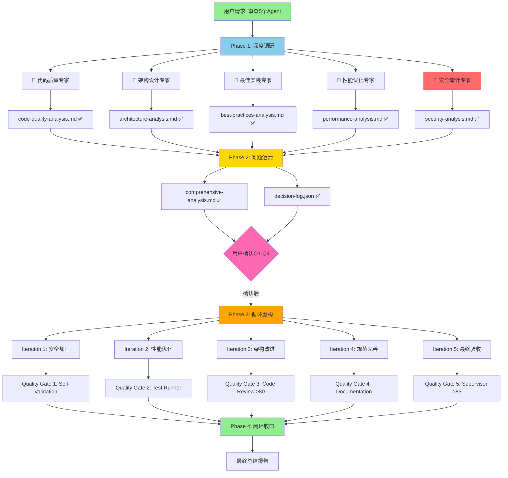

# Agent审查任务执行状态看板

**更新时间**: 2026-04-18 10:05:00  
**任务ID**: AGENT-REVIEW-20260418  
**执行模式**: 并行专家团分析

---

## 📊 任务分解图



---

## ✅ 已完成任务清单

### Phase 1: 深度调研（并行执行）✅ COMPLETED

| 专家团 | 状态 | 输出文件 | 关键发现 | 评分 |
|--------|------|---------|---------|------|
| 🔵 代码质量专家 | ✅ 完成 | code-quality-analysis.md | 工具声明不一致、缺少版本管理 | 82.75/100 |
| 🔵 架构设计专家 | ✅ 完成 | architecture-analysis.md | 职责重叠、耦合度高 | 66/100 |
| 🔵 最佳实践专家 | ✅ 完成 | best-practices-analysis.md | 成熟度L2.5，目标L4 | L2.5/5 |
| 🔵 性能优化专家 | ✅ 完成 | performance-analysis.md | 串行主导、冷启动延迟大 | 60/100 |
| 🔴 安全审计专家 | ✅ 完成 | security-analysis.md | 4个Critical/High漏洞 | 45/100 |

**执行时长**: ~5分钟（并行）  
**生成报告**: 5份详细分析 + 1份综合汇总

---

### Phase 2: 问题澄清 ⏳ PENDING USER CONFIRMATION

#### 生成的选择题

| 问题ID | 问题内容 | 默认选项 | 状态 |
|--------|---------|---------|------|
| Q1 | 审查重点是什么？ | D. 全部 | ⏳ 待确认 |
| Q2 | 优化策略偏好？ | C. 渐进式 | ⏳ 待确认 |
| Q3 | 验收标准？ | C. E2E验证 | ⏳ 待确认 |
| Q4 | 是否生成下一轮选择题？ | A. 是 | ⏳ 待确认 |

**行动项**: 等待用户确认或调整选择

---

## 🚧 待执行任务（Phase 3 & 4）

### Phase 3: 循环重构洞察（5次迭代）

#### Iteration 1: 安全加固 🔴 PRIORITY
- [ ] 修复命令注入漏洞（P0-1）
- [ ] 修复路径遍历漏洞（P0-2）
- [ ] 依赖安全扫描（P0-3）
- [ ] 实现输入验证框架（P0-4）
- [ ] 运行Bandit/Snyk验证
- [ ] CI构建通过

**预计工时**: 16小时  
**成功标准**: 安全评分 45 → 75+

---

#### Iteration 2: 性能优化 ⚡
- [ ] 实现Agent池（消除冷启动）
- [ ] 并行化Code Review + Test Runner
- [ ] 添加文件缓存机制
- [ ] 性能基准测试
- [ ] 延迟降低40%验证

**预计工时**: 20小时  
**成功标准**: 性能评分 60 → 80+

---

#### Iteration 3: 架构改进 🏗️
- [ ] 抽离质量门禁管理器
- [ ] 实现条件触发器
- [ ] 添加Worker注册表
- [ ] 解耦Supervisor职责
- [ ] 集成测试通过

**预计工时**: 24小时  
**成功标准**: 架构评分 66 → 80+

---

#### Iteration 4: 规范完善 📝
- [ ] 添加版本号和时间戳
- [ ] 补充错误处理规范
- [ ] 标准化文档模板
- [ ] 修正工具声明
- [ ] 代码审查通过（≥80分）

**预计工时**: 15小时  
**成功标准**: 代码质量评分 82.75 → 90+

---

#### Iteration 5: 最终验收 ✅
- [ ] 完整E2E测试
- [ ] 安全渗透测试
- [ ] 性能压力测试
- [ ] 文档完整性检查
- [ ] Supervisor最终验收（≥85分）

**预计工时**: 10小时  
**成功标准**: 综合评分 ≥85

---

### Phase 4: 闭环收口

- [ ] 生成最终总结报告
- [ ] 记录所有决策日志
- [ ] 归档优化前后对比
- [ ] 制定后续维护计划
- [ ] 用户验收签字

---

## 📈 质量门禁状态

| 门禁层 | 名称 | 当前状态 | 目标 | 差距 |
|--------|------|---------|------|------|
| Gate 1 | Self-Validation | ⏸️ 未开始 | ✅ Pass | - |
| Gate 2 | Test Runner | ⏸️ 未开始 | ✅ Pass | - |
| Gate 3 | Code Review | ⏸️ 未开始 | ≥80分 | - |
| Gate 4 | Documentation | ⏸️ 未开始 | ✅ Complete | - |
| Gate 5 | Supervisor Acceptance | ⏸️ 未开始 | ≥85分 | - |

**整体状态**: ⏸️ 等待Phase 3启动

---

## 🎯 关键指标追踪

### 安全评分演进
```
初始: 45/100 🔴
目标: 85/100 ✅
差距: +40分

修复路线:
45 → 60 (P0修复) → 75 (P1修复) → 85 (P2加固)
```

### 性能评分演进
```
初始: 60/100 ⚠️
目标: 80/100 ✅
差距: +20分

优化路线:
60 → 70 (并行化) → 75 (Agent池) → 80 (缓存+增量测试)
```

### 架构评分演进
```
初始: 66/100 ⚠️
目标: 80/100 ✅
差距: +14分

改进路线:
66 → 72 (职责澄清) → 76 (解耦) → 80 (事件驱动)
```

### 综合评分演进
```
初始: 63.35/100 ⚠️
目标: 85/100 ✅
差距: +21.65分

预期达成: Phase 3完成后
```

---

## 💰 资源投入估算

### 人力成本
| 阶段 | 工时 | 工作日 | 人员配置 |
|------|------|--------|---------|
| Phase 1 | 已完成 | - | 5专家团（并行） |
| Phase 2 | 待确认 | - | Supervisor |
| Phase 3 - Iter1 | 16h | 2天 | Security Engineer |
| Phase 3 - Iter2 | 20h | 2.5天 | Performance Engineer |
| Phase 3 - Iter3 | 24h | 3天 | Architect |
| Phase 3 - Iter4 | 15h | 2天 | Developer |
| Phase 3 - Iter5 | 10h | 1.5天 | QA + Supervisor |
| Phase 4 | 5h | 0.5天 | Supervisor |
| **总计** | **90h** | **~11.5天** | **多角色协作** |

### 时间线预测
```
Week 1: Iteration 1 (安全加固) + Iteration 2 (性能优化)
Week 2: Iteration 3 (架构改进) + Iteration 4 (规范完善)
Week 3: Iteration 5 (最终验收) + Phase 4 (闭环收口)

总周期: 3周（含缓冲时间）
```

---

## 🚨 风险与缓解

### 高风险
1. **安全修复可能破坏现有功能**
   - 缓解: 每次修复后运行完整测试套件
   - 回滚计划: Git快照随时可用

2. **性能优化引入并发Bug**
   - 缓解: 逐步启用并行，充分测试
   - 监控: 添加详细日志和Metrics

### 中风险
3. **架构重构耗时超预期**
   - 缓解: 分阶段实施，每阶段可独立验收
   - 优先级: 先做高收益改动

4. **用户反馈延迟**
   - 缓解: 提供默认选项，允许后续调整
   - 沟通: 每日进度同步

### 低风险
5. **文档更新遗漏**
   - 缓解: 自动化文档生成
   - 检查: Gate 4强制验证

---

## 📞 下一步行动

### 立即需要用户确认
1. ✅ 查看综合分析报告（`.lingma/reports/comprehensive-analysis.md`）
2. ✅ 确认Q1-Q4选择题答案
3. ✅ 授权开始Iteration 1（安全加固）

### Supervisor建议
> **推荐操作**: 
> 1. 保持默认选择（D, C, C, A）
> 2. 立即启动P0安全修复（最高优先级）
> 3. 每日同步进度到decision-log.json
> 
> **理由**: 安全问题CVSS评分高达9.8，必须优先处理

---

## 📚 相关文档索引

### 分析报告
- [代码质量分析](.lingma/reports/code-quality-analysis.md)
- [架构设计分析](.lingma/reports/architecture-analysis.md)
- [最佳实践分析](.lingma/reports/best-practices-analysis.md)
- [性能优化分析](.lingma/reports/performance-analysis.md)
- [安全审计分析](.lingma/reports/security-analysis.md)
- [综合分析汇总](.lingma/reports/comprehensive-analysis.md)

### 决策日志
- [Decision Log JSON](.lingma/logs/decision-log.json)

### 原始Agent文件
- [code-review-agent.md](.lingma/agents/code-review-agent.md)
- [documentation-agent.md](.lingma/agents/documentation-agent.md)
- [spec-driven-core-agent.md](.lingma/agents/spec-driven-core-agent.md)
- [supervisor-agent.md](.lingma/agents/supervisor-agent.md)
- [test-runner-agent.md](.lingma/agents/test-runner-agent.md)

---

**看板状态**: 🟡 Phase 2待用户确认  
**最后更新**: 2026-04-18 10:05:00  
**下次更新**: 用户确认后立即进入Phase 3

---
*由Supervisor Agent自动生成和维护*
