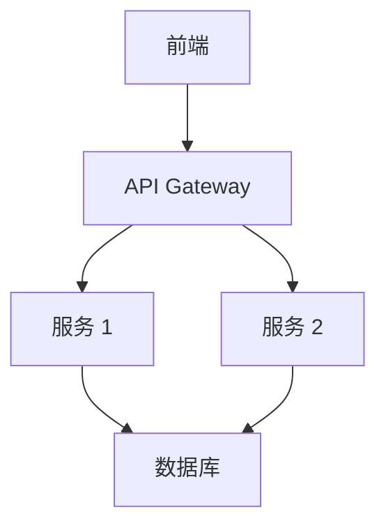

# Feature Specification Template

## 元数据
- **创建日期**: {{DATE}}
- **状态**: draft | approved | in-progress | completed | cancelled
- **优先级**: P0 | P1 | P2 | P3
- **负责人**: {{OWNER}}

## 背景与目标
### 问题陈述
[描述要解决的问题或需求]

### 业务价值
[说明为什么需要这个功能，带来什么价值]

### 成功标准
- [ ] [可衡量的成功指标 1，例如：性能提升 50%]
- [ ] [可衡量的成功指标 2，例如：用户满意度提升到 4.5/5]
- [ ] [可衡量的成功指标 3，例如：错误率降低到 < 1%]

## 需求规格
### 功能性需求

#### FR-001: [需求名称]
**描述**: [详细描述这个功能需求]

**用户故事**:
```
作为 [角色]
我想要 [功能]
以便于 [价值/目标]
```

**验收标准**:
- [ ] AC-001: [具体的、可测试的验收条件]
- [ ] AC-002: [具体的、可测试的验收条件]
- [ ] AC-003: [具体的、可测试的验收条件]

**优先级**: Must have | Should have | Could have | Won't have

**依赖**: [依赖的其他需求或系统]

---

#### FR-002: [需求名称]
[同上格式]

### 非功能性需求

#### NFR-001: 性能要求
**要求**: [具体性能指标，如：响应时间 < 200ms]

**验收标准**: 
- [ ] 在 [条件] 下，[指标] 达到 [目标值]
- [ ] 压力测试通过：[具体场景]

---

#### NFR-002: 安全要求
**要求**: [安全相关的要求]

**验收标准**:
- [ ] 通过安全扫描
- [ ] 符合 [安全标准/规范]

---

#### NFR-003: 可用性要求
**要求**: [易用性、可访问性等要求]

**验收标准**:
- [ ] 符合 WCAG 2.1 AA 标准
- [ ] 用户测试通过率 > 90%

## 技术方案
### 架构设计

[系统架构图 - 可以使用 Mermaid 或其他图表]



### 技术选型

| 技术/库 | 版本 | 选择理由 | 备选方案 |
|---------|------|----------|----------|
| [技术 1] | [版本] | [理由] | [备选] |
| [技术 2] | [版本] | [理由] | [备选] |

### 数据模型

#### 新增表/集合

```sql
-- 示例：SQL Schema
CREATE TABLE example_table (
    id UUID PRIMARY KEY,
    name VARCHAR(255) NOT NULL,
    created_at TIMESTAMP DEFAULT NOW(),
    updated_at TIMESTAMP DEFAULT NOW()
);
```

或

```typescript
// 示例：TypeScript Interface
interface ExampleModel {
  id: string;
  name: string;
  createdAt: Date;
  updatedAt: Date;
}
```

#### 数据迁移

[如果有数据迁移，描述迁移策略]

### API 设计

#### RESTful API

```typescript
// GET /api/v1/resource
interface GetResourceRequest {
  // Query parameters
  page?: number;
  limit?: number;
}

interface GetResourceResponse {
  data: Resource[];
  total: number;
  page: number;
  limit: number;
}

// POST /api/v1/resource
interface CreateResourceRequest {
  name: string;
  description?: string;
}

interface CreateResourceResponse {
  id: string;
  name: string;
  createdAt: Date;
}
```

#### GraphQL (如适用)

```graphql
type Resource {
  id: ID!
  name: String!
  description: String
  createdAt: DateTime!
}

type Query {
  resources(page: Int, limit: Int): ResourceConnection!
}

type Mutation {
  createResource(input: CreateResourceInput!): Resource!
}
```

### 组件设计 (前端)

```typescript
// 主要组件结构
interface ComponentProps {
  // props 定义
}

const ExampleComponent: React.FC<ComponentProps> = ({ ... }) => {
  // 组件实现
};
```

### 状态管理

[描述状态管理方案，如 Redux store structure, Zustand stores 等]

## 实现计划
### 任务分解

#### Phase 1: 基础架构 (预计: Xh)
- [ ] Task-001: [任务描述] (预计: Xh)
  - 子任务:
    - [ ] Subtask-001-01: [描述]
    - [ ] Subtask-001-02: [描述]
  - 验收标准: [如何确认完成]
  
- [ ] Task-002: [任务描述] (预计: Xh)

#### Phase 2: 核心功能 (预计: Xh)
- [ ] Task-003: [任务描述] (预计: Xh)
- [ ] Task-004: [任务描述] (预计: Xh)

#### Phase 3: 集成与测试 (预计: Xh)
- [ ] Task-005: [任务描述] (预计: Xh)
- [ ] Task-006: [任务描述] (预计: Xh)

#### Phase 4: 优化与文档 (预计: Xh)
- [ ] Task-007: [任务描述] (预计: Xh)
- [ ] Task-008: [任务描述] (预计: Xh)

**总预估时间**: XX 小时

### 依赖关系

```
Task-001 --> Task-002 --> Task-003
                  \--> Task-004
Task-003 + Task-004 --> Task-005
```

### 风险评估

| 风险 | 概率 | 影响 | 缓解措施 | 应急预案 |
|------|------|------|----------|----------|
| [风险 1] | 高/中/低 | 高/中/低 | [措施] | [预案] |
| [风险 2] | 高/中/低 | 高/中/低 | [措施] | [预案] |

## 测试策略
### 单元测试

**覆盖目标**: ≥ 80%

**关键测试场景**:
- [ ] 场景 1: [描述]
- [ ] 场景 2: [描述]

### 集成测试

**测试场景**:
- [ ] 场景 1: [描述，包括前置条件、步骤、预期结果]
- [ ] 场景 2: [描述]

### E2E 测试

**关键用户流程**:
- [ ] 流程 1: [描述完整的用户操作流程]
- [ ] 流程 2: [描述]

### 性能测试

**测试场景**:
- [ ] 负载测试: [并发用户数、持续时间]
- [ ] 压力测试: [极限条件]
- [ ] 稳定性测试: [长时间运行]

## 部署计划
### 前置条件
- [ ] [依赖的服务已部署]
- [ ] [数据库迁移已准备]
- [ ] [配置文件已更新]

### 部署步骤

#### 开发环境
1. [步骤 1]
2. [步骤 2]
3. [验证步骤]

#### 测试环境
1. [步骤 1]
2. [步骤 2]
3. [验证步骤]

#### 生产环境
1. [步骤 1 - 包含回滚点]
2. [步骤 2]
3. [监控和验证]

### 回滚方案

**触发条件**:
- [条件 1，如：错误率 > 5%]
- [条件 2，如：响应时间 > 1s]

**回滚步骤**:
1. [步骤 1]
2. [步骤 2]
3. [验证回滚成功]

**数据回滚**:
[如果需要数据回滚，描述方案]

## 监控与告警
### 关键指标

| 指标 | 阈值 | 告警级别 | 响应时间 |
|------|------|----------|----------|
| [指标 1] | [阈值] | P0/P1/P2 | [时间] |
| [指标 2] | [阈值] | P0/P1/P2 | [时间] |

### 日志记录

**关键日志点**:
- [日志点 1]: [记录内容、级别]
- [日志点 2]: [记录内容、级别]

## 文档更新
- [ ] 更新用户手册
- [ ] 更新 API 文档 (Swagger/OpenAPI)
- [ ] 更新开发者文档
- [ ] 更新 CHANGELOG
- [ ] 更新 README (如需要)

## 评审记录
### 技术评审
- **评审人**: [姓名]
- **评审日期**: YYYY-MM-DD
- **评审意见**:
  - [意见 1]
  - [意见 2]
- **批准状态**: ✅ 批准 / ❌ 需修改

### 产品评审
- **评审人**: [姓名]
- **评审日期**: YYYY-MM-DD
- **评审意见**:
  - [意见 1]
  - [意见 2]
- **批准状态**: ✅ 批准 / ❌ 需修改

### 安全评审 (如需要)
- **评审人**: [姓名]
- **评审日期**: YYYY-MM-DD
- **评审意见**: [意见]
- **批准状态**: ✅ 批准 / ❌ 需修改

## 实施笔记
[在实施过程中添加笔记]

### 实施笔记 - {{DATE}} {{TIME}}
**完成**: [任务描述]

**关键决策**:
- [决策 1]: [理由]
- [决策 2]: [理由]

**遇到的问题**:
- 问题: [描述]
- 解决: [解决方案]

**测试结果**:
- 单元测试: X/Y 通过
- 集成测试: X/Y 通过

**下一步**: [计划]

## 变更记录
| 日期 | 版本 | 变更内容 | 变更人 | 审批人 |
|------|------|----------|--------|--------|
| {{DATE}} | v1.0 | 初始版本 | [姓名] | [姓名] |
| | | | | |

## 附录
### 参考资料
- [链接 1]: [描述]
- [链接 2]: [描述]

### 术语表
- **术语 1**: [定义]
- **术语 2**: [定义]

### 相关问题
- Issue #[number]: [标题]
- PR #[number]: [标题]
