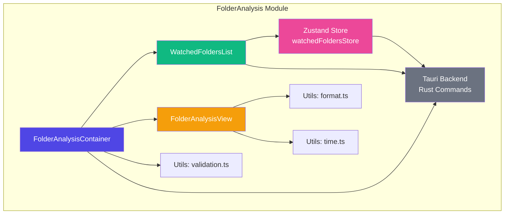
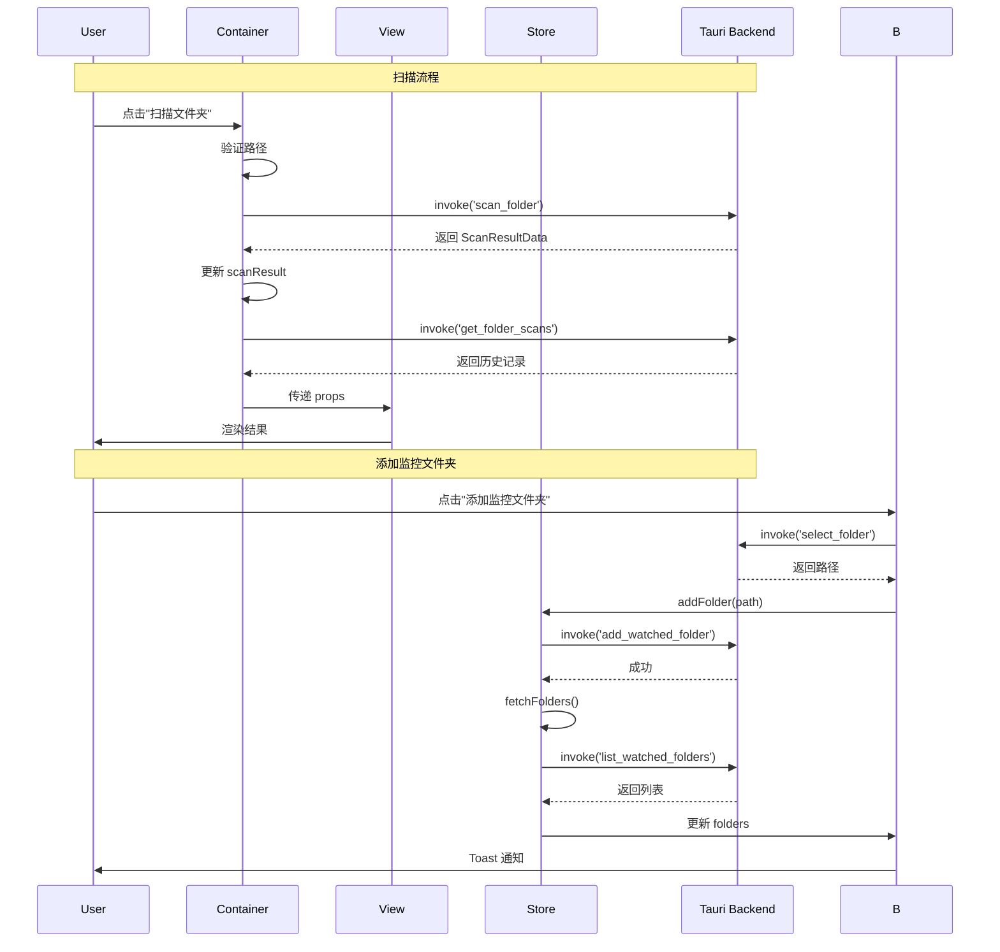
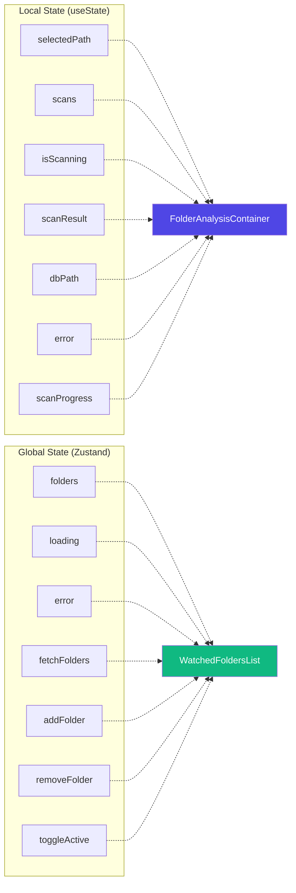
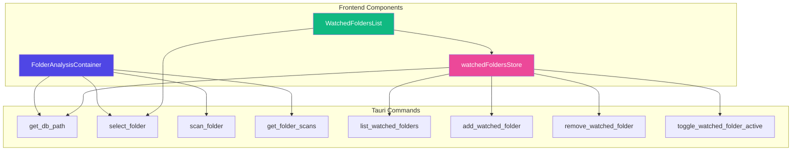
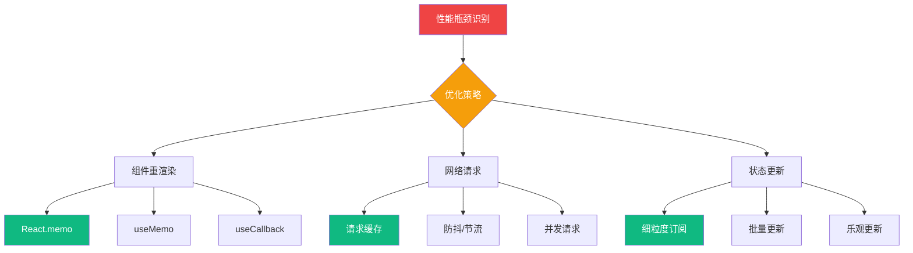
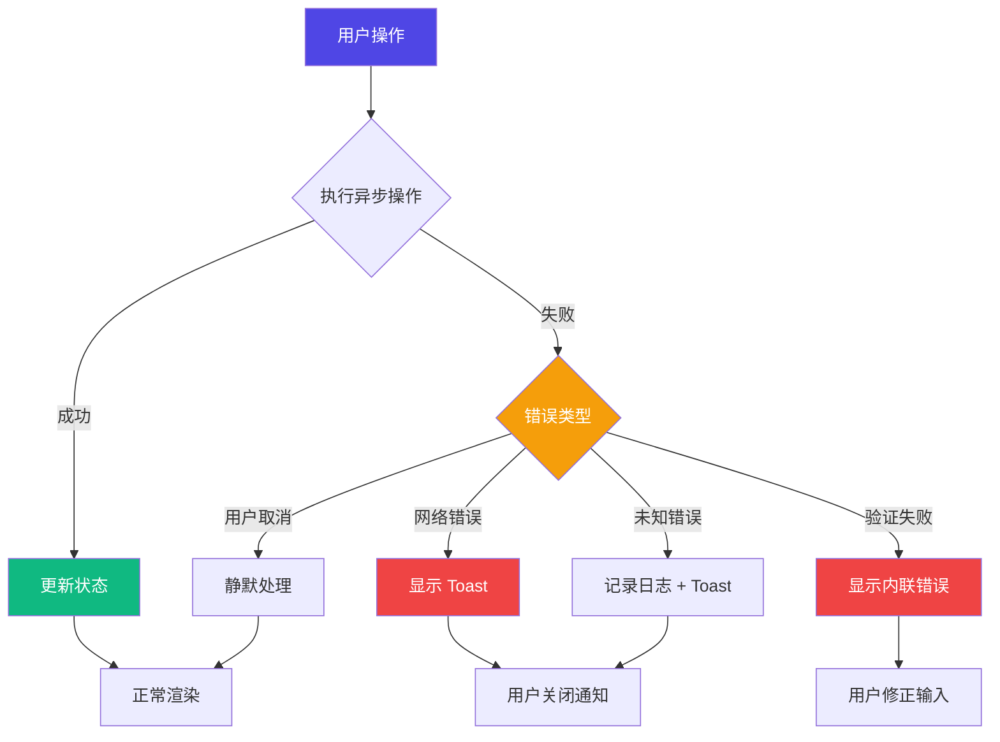
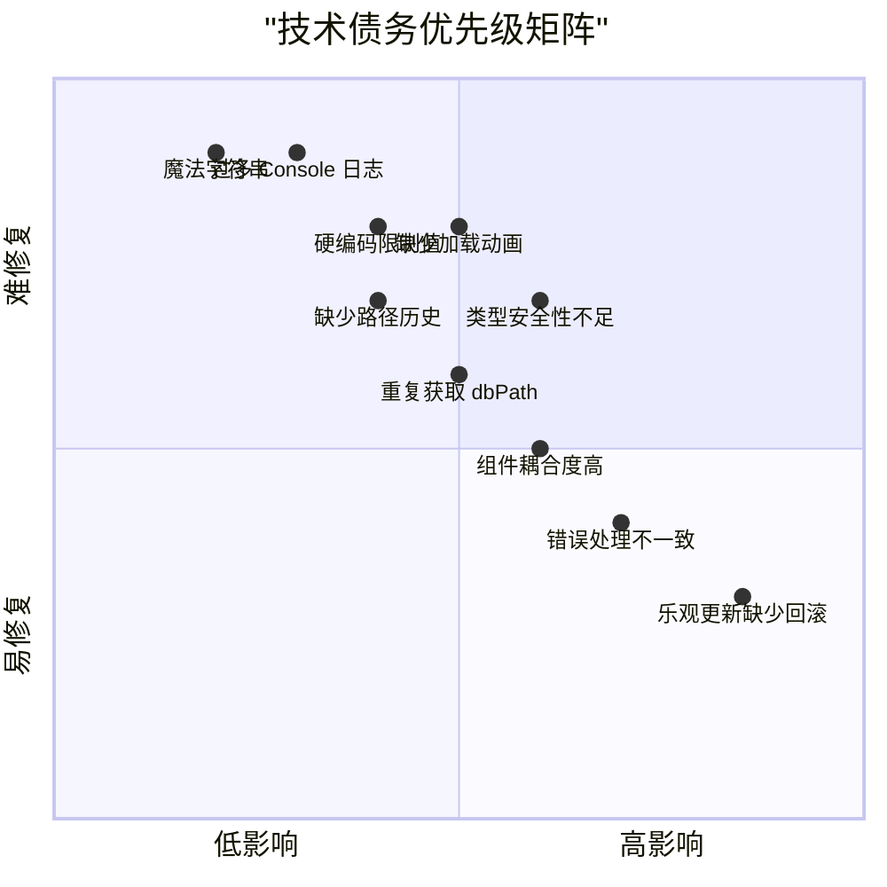

# FolderAnalysis 模块 - 架构总览图

## 📊 组件层级关系

## 🔄 数据流向图

## 🗂️ 状态管理架构

## 🔌 API 调用关系

## 🎯 组件职责矩阵

| 组件 | 状态管理 | UI 渲染 | 业务逻辑 | Tauri 调用 | Store 集成 |
|------|---------|---------|---------|-----------|-----------|
| **FolderAnalysisContainer** | ✅ | ❌ | ✅ | ✅ | ❌ |
| **FolderAnalysisView** | ❌ | ✅ | ❌ | ❌ | ❌ |
| **WatchedFoldersList** | ⚠️ 部分 | ✅ | ✅ | ✅ | ✅ |
| **watchedFoldersStore** | ✅ | ❌ | ✅ | ✅ | N/A |

✅ = 主要职责  ⚠️ = 部分涉及  ❌ = 不涉及

## 📈 性能优化建议

## 🔐 错误处理流程

## 📝 技术债务优先级

---

**图表说明**:
- 使用 Mermaid 语法绘制，可在支持 Mermaid 的 Markdown 编辑器中查看
- 推荐工具: GitHub、GitLab、VS Code (Mermaid 插件)、Notion
